# Claim Graph V0

Sources of truth for this first version are `oxygen/figures/claimsGraph.md` and `/Users/4470246/Downloads/notes_hypoxiaLTEE.txt`.

This is a planning scaffold, not an evidence audit. Claims are frozen for v0, every node has a figure/panel contract, and all nodes remain `not_audited` until panel sketches and data-backed panels exist.

Graph convention: arrows are drawn from parent node to child node to keep the root thesis on the left and supporting nodes to the right. The edge label describes how the child relates to its parent in the manifest: `supports`, `mechanism`, or `qualifies`.

## Node Types

| Type | Role |
|---|---|
| `root_thesis` | Top-level manuscript thesis. |
| `main_biological_claim` | Main claim intended for the primary six-figure sequence. |
| `supporting_analysis_claim` | Secondary analysis claim or interpretation attached to a main claim. |
| `methods_guardrail` | Interpretation constraint that should qualify biological reading but not act as biological evidence. |
| `implementation_provenance_note` | Reproducibility or implementation condition that belongs in Methods or supplement. |

## Rendered Graph

- `oxygen/figures/claim_graph_v0.svg`
- `oxygen/figures/claim_graph_v0.png`

## Mermaid Graph

```mermaid
flowchart LR
  R0["R0<br/>Resource limitation rewires ploidy evolution<br/>Fig. 2A<br/>root_thesis"]

  subgraph F1["Figure 1: Experimental system and data streams"]
    C1["C1<br/>Matched SUM159 2N/4N comparison<br/>Fig. 1A<br/>main"]
  end

  subgraph F2["Figure 2: Model mechanism"]
    C2["C2<br/>Resource limitation can oppose and promote high ploidy<br/>Fig. 2B<br/>main"]
    S8["S8<br/>CIN therapy implication<br/>Fig. S2A<br/>support"]
    P3["P3<br/>Dead-compartment description matches implementation<br/>Fig. S2B<br/>provenance"]
  end

  subgraph F3["Figure 3: Separate in vitro and in vivo fits"]
    C7["C7<br/>In vitro O2 reshapes ploidy without strong high-ploidy elimination<br/>Fig. 3A<br/>main"]
    C8["C8<br/>CIN plus survival buffering can lower ploidy in vitro<br/>Fig. 3B<br/>main"]
    S10["S10<br/>Separate in vivo fits bridge to context comparison<br/>Fig. 3C<br/>support"]
    S9["S9<br/>Current fit does not prove ploidy-independent division<br/>Fig. S3A<br/>support"]
  end

  subgraph F4["Figure 4: Joint context differences"]
    C3["C3<br/>Tumor stress is broader than lower oxygen<br/>Fig. 4A<br/>main"]
    C4["C4<br/>Joint fits infer proliferation, CIN, and survival-filter axes<br/>Fig. 4B<br/>main"]
    S7["S7<br/>Oxygen is incomplete resource proxy<br/>Fig. S4A<br/>support"]
    P1["P1<br/>Soft-coupling settings affect run comparability<br/>Fig. S4B<br/>provenance"]
    P4["P4<br/>Warm-start/default workflow provenance<br/>Fig. S4C<br/>provenance"]
  end

  subgraph F5["Figure 5: Fixed-O2 resource-regime behavior"]
    C5["C5<br/>Dominant ploidy is resource-regime dependent<br/>Fig. 5A<br/>main"]
    S1["S1<br/>Mode predictability depends on O2<br/>Fig. 5B<br/>support"]
    S2["S2<br/>Low-resource behavior is death dominated<br/>Fig. 5C<br/>support"]
    S3["S3<br/>Intermediate O2 is tradeoff dependent<br/>Fig. 5D<br/>support"]
    S4["S4<br/>High-resource behavior depends on missegregation and buffering<br/>Fig. 5E<br/>support"]
    S5["S5<br/>Continuous dominant ploidy supports discrete modes<br/>Fig. 5F<br/>support"]
    M1["M1<br/>Fixed-O2 attractors differ from finite-time trajectories<br/>Fig. S5A<br/>guardrail"]
  end

  subgraph F6["Figure 6: Parameter landscape and candidate biological regimes"]
    C6["C6<br/>Multiple solution regions may be biological regimes<br/>Fig. 6A<br/>main"]
    S6["S6<br/>Curve classes are richer than binary modes<br/>Fig. 6B<br/>support"]
    M2["M2<br/>Prior-aware preprocessing required<br/>Fig. S6A<br/>guardrail"]
    M3["M3<br/>Model-implied features translate regimes<br/>Fig. S6B<br/>guardrail"]
    P2["P2<br/>Start tables and bounds affect optimizer region<br/>Fig. S6C<br/>provenance"]
  end

  R0 -->|supports| C1
  R0 ==>|mechanism| C2
  R0 -.->|qualifies| C3
  R0 -->|supports| C4
  R0 -->|supports| C5
  R0 -.->|qualifies| C6
  R0 -->|supports| C7

  C7 ==>|mechanism| C8
  C4 -->|supports| S10
  C5 -->|supports| S1
  C5 -->|supports| S2
  C5 -->|supports| S3
  C5 -->|supports| S4
  C5 -->|supports| S5
  C6 -->|supports| S6
  C3 -.->|qualifies| S7
  C2 -.->|qualifies| S8
  C7 -.->|qualifies| S9

  C5 -.->|qualifies| M1
  C6 -.->|qualifies| M2
  C6 -->|supports| M3
  C4 -.->|qualifies| P1
  C6 -.->|qualifies| P2
  C2 -.->|qualifies| P3
  C4 -.->|qualifies| P4

  classDef root fill:#1f2937,color:#ffffff,stroke:#111827,stroke-width:2px;
  classDef main fill:#dbeafe,stroke:#1d4ed8,stroke-width:2px,color:#111827;
  classDef support fill:#ecfdf5,stroke:#047857,color:#111827;
  classDef guard fill:#f3f4f6,stroke:#6b7280,color:#111827;
  classDef prov fill:#f8fafc,stroke:#64748b,stroke-dasharray: 5 5,color:#111827;

  class R0 root;
  class C1,C2,C3,C4,C5,C6,C7,C8 main;
  class S1,S2,S3,S4,S5,S6,S7,S8,S9,S10 support;
  class M1,M2,M3 guard;
  class P1,P2,P3,P4 prov;
```

## Figure Spine

| Figure | Primary role | Primary nodes |
|---|---|---|
| Figure 1 | Establish the matched SUM159 2N/4N experimental system and data streams. | C1 |
| Figure 2 | Define the resource-stress mechanism and the opposing effects of chromosome burden and buffering. | R0, C2 |
| Figure 3 | Summarize separate in vitro and in vivo fit behavior, including the in vitro CIN/buffering route and the in vivo bridge to joint comparison. | C7, C8, S10 |
| Figure 4 | Compare in vitro and in vivo context differences while guarding against literal oxygen-only interpretation. | C3, C4 |
| Figure 5 | Show fixed-O2 resource-regime behavior and the low/intermediate/high O2 driver structure. | C5, S1, S2, S3, S4, S5 |
| Figure 6 | Show parameter-landscape structure, curve classes, and candidate biological regimes. | C6, S6 |

## V0 Design Notes

- Main biological claims are grouped by the six-figure sequence rather than analysis chronology.
- Supporting nodes are attached to the strongest parent only. Secondary relationships can be added later if a panel requires them.
- Guardrail and provenance nodes are kept in supplemental panels so they qualify interpretation without becoming biological evidence nodes.
- `C8` is treated as a main claim but attached under `C7` because it is the mechanism explaining the separate in vitro fit interpretation.
- `S10` is a conservative Figure 3 bridge node attached under `C4`, because the separate in vivo fits are needed to ground the later joint context comparison without adding a stronger biological claim.
- `S8` remains supplemental because it is an implication unless direct drug-response analyses are included.
