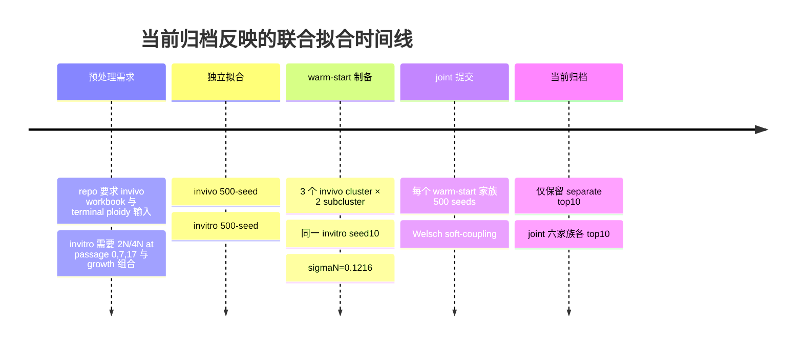

# LTEE 联合拟合结果深度审计报告

## 执行摘要

本次审计以当前会话中可访问的上传物为准：我实际拿到并解析了 `prompt.md` 与 `top10.zip`；我**没有在当前会话可访问目录中找到**用户描述的 `joint_pre.zip`。因此，关于“预处理是否满足要求”的结论只能做到**间接核验**，不能做到对 `joint_pre.zip` 原始内容的逐文件比对。与此同时，`prompt.md` 的正文并不是一份联合拟合审计 SOP，而是一份“审阅 manuscript 与仓库、生成修改意见”的任务说明，所以它对预处理、CI/后验、seed 稳定性等并无可执行的逐项规范；本报告因此以你在后续消息里列出的六项任务为主线，把 `prompt.md` 当作项目上下文，而不是唯一的分析协议。

从仓库公开分支 `HypoxiaLTEEFigures` 的 `oxygen/README.md` 与后端代码看，当前工作流支持独立 in vivo、独立 in vitro 与 joint fitting，joint 目标函数为  
`objective_total = joint_weight_invivo * invivo_objective + joint_weight_invitro * invitro_objective + objective_soft_coupling + objective_constraints`；14 个生物学参数采用 center/delta 的 soft coupling 表示，并使用 Welsch 型惩罚，`c = 0.4` 时惩罚上限为 `0.5*c^2 = 0.08`。README 还明确给出了 warm-start start-table 的必需列，以及 joint 输出文件的标准命名。citeturn8view0turn9view0turn13view0turn14view0turn15view0

就当前归档内容而言，`top10.zip` 包含 80 个保留 seed 目录，结构为：独立 in vivo 10 个 seed，独立 in vitro 10 个 seed，joint 结果 6 个 warm-start 家族 × 每家族 10 个 top seeds；根目录还有一个 `top10_index.tsv` 作为总索引。就**总 objective** 而言，最优 joint 家族是 `seed366_C01Sc01`，最优 seed 为 `seed472`，总 objective 为 **18.8523**；第二名是 `seed322_C02Sc02/seed54`，总 objective 为 **18.8901**。但如果只看**未加 soft-coupling 惩罚的数据拟合项**，则 `seed25_C02Sc01/seed497` 的 unpenalized objective 最低，为 **17.9681**，略优于 `seed366_C01Sc01/seed472` 的 **17.9849**；也就是说，**按 joint 设计目标函数选最优模型，首选 `seed366_C01Sc01/seed472`；按“纯数据拟合”选最优模型，则 `seed25_C02Sc01/seed497` 更优，但代价是上下文分离更大、软耦合罚项更高**。这一点与 README/代码中“总目标函数包含软耦合正则”的定义是完全一致的。citeturn9view0turn14view0

科学结论层面，当前 top10 joint 结果**强烈支持** manuscript 的三条核心表述：其一，`lam_max` 在联合拟合中稳定表现为 **in vivo < in vitro**；其二，`p_misseg` 稳定表现为 **in vivo > in vitro**；其三，后错分裂存活过滤的 ploidy dependence 在 in vivo 更强，表现为 `buffer_beta` 明显更低、`buffer_smax` 略低，而 `buffer_n_exp` 在 60 个 joint run 里有 40 个表现为更高。manuscript 在结果与讨论部分恰好把这三点列为 joint fit 的主要生物学假设输出。citeturn5view0turn5view1

不过，也存在三个重要缺口。第一，`joint_pre.zip` 未提供，导致 warm-start 选择、t-SNE 聚类、预处理对象完整性无法按原件逐项核对。第二，所有 `necrosis_fit.tsv` / `invivo_necrosis_fit.tsv` 的预测列在归档中均为 `NA`，但 `fit_summary.tsv` 中又存在非零的 necrosis objective 贡献，这意味着**necrosis 残差无法从当前导出的 TSV 直接复现**。第三，当前归档并没有 profile likelihood、posterior、MCMC 或 bootstrap CI 文件，因此本报告给出的“区间”只能是**保留 top hits 的经验分位区间**，不能冒充真正的置信区间或后验区间。仓库代码表明更丰富的优化对象与 trace 被保存进 `fit_result.rds`，但当前环境无法直接读取 RDS。citeturn13view0turn15view0

| 结果组 | 保留 seed 数 | 最优 objective | 最差 objective | 均值 | 标准差 | 跨度占最优% |
|:--|--:|--:|--:|--:|--:|:--|
| invitro | 10 | 3.8525 | 3.8623 | 3.8586 | 0.0038 | 0.25% |
| invivo | 10 | 14.1193 | 14.1748 | 14.1514 | 0.0186 | 0.39% |
| joint | 60 | 18.8523 | 20.0192 | 19.3301 | 0.4537 | 6.19% |

## 资料与判读依据

本报告的判读依据分成三层。第一层是你上传的结果归档：`top10/top10_index.tsv`、各 seed 目录下的 `fit_summary.tsv`、参数表、YAML、TSV、日志和 HTML 报告。第二层是公开仓库 `thecloneredesignlab/miningcloneid` 的 `HypoxiaLTEEFigures` 分支，尤其是 `oxygen/README.md`、统一入口脚本 `fit_model_O2_supply_demand_MAP.R`、joint backend、独立 in vivo backend、独立 in vitro backend。第三层是 manuscript 源文件 `manuscript/ltee_hypoxia_model.tex`，用于核对本次模型输出是否支持文稿中的科学叙述。仓库 README 明确指出 oxygen 工作流的主入口、runner、submitter、joint warm-start 机制、soft-coupling 参数集合、输出文件名和含义；joint backend 则给出了逐个输出文件的写出位置与 `fit_summary.tsv` 的指标名。citeturn7view0turn8view0turn9view0turn13view0turn15view0turn17view0turn17view4

manuscript 的结果部分明确把 joint 分析定位为：用同一套 mechanistic model 比较 matched `in vivo`/`in vitro` 轨迹，观察哪些机制在 soft coupling 下仍然必须分离。文稿对 joint fit 的核心结论是：`lam_max` 在 in vivo 更低，stress-linked `p_misseg` 在 in vivo 更高，post-missegregation survival 在 in vivo 更依赖 ploidy；同时 six warm starts 来自 three clusters × two subclusters，并统一配对同一个最佳独立 in vitro seed 10。citeturn18view0turn5view0turn5view1

本报告的主要限制也需要提前说明。由于 `joint_pre.zip` 不在当前可访问上传集合中，我无法直接验证预处理产物本身；由于 top10 归档只保留每组最优的若干 seed，而不是全部 500-seed 结果，经验区间天然带有**选择偏倚**；由于 RDS 文件未被当前环境直接解析，本报告中的“收敛诊断”主要依赖 `fit_summary.tsv`、`single_stage_pass_summary.tsv`、`joint_components.tsv` 和日志，而不是完整 per-iteration trace。代码显示更完整的 `optimizer_trace`、`deoptim` 与 `local_optim` 对象是被保存进 `fit_result.rds` 的，这与当前环境可见的 TSV 层级不同。citeturn15view0

## 预处理核查与输出映射

先说核查结论：我**不能**完成“`joint_pre.zip` 与 prompt 要求逐项一致”的严格验收，因为 `joint_pre.zip` 本身没有出现在当前可访问上传物中；同时 `prompt.md` 也没有把联合拟合预处理规则写成可执行 checklist。能做的是：按 repo 代码反推**应当满足的预处理条件**，再用当前 joint 归档里的间接痕迹检查 warm-start 与 start-table 是否一致。统一入口脚本对独立 in vivo 输入的硬性要求包括：`data_dir` 下必须有 `dt_Gem_VT_20260209_v5.xlsx`，并且能够解析 terminal ploidy 数据；对独立 in vitro 输入的硬性要求包括：ploidy 分布必须至少覆盖 `2N/4N × passage 0,7,17`，growth 数据必须覆盖 `2N/4N × o2=0,1`，且至少有一个 `passage >= 1` 的观测。citeturn19view1turn19view0

在当前 joint 归档里，可以被**间接核实**的部分是 warm-start 机制。README 说明，joint start-table 应包含 `param_name`, `value`, `scale`, `seed_label`, `invivo_seed_label`, `invitro_seed_label`，joint backend 会把 warm-start 与 start-table 应用情况写到 `joint_warmup_initial_values.tsv` 与 `joint_soft_coupling_initial_values.tsv`，并把最终 start-table 副本保存在 `joint_soft_coupling_parameters_table_input.csv`。我对 6 个 joint 家族逐一核对后发现：这 6 个家族的 `joint_soft_coupling_parameters_table_input.csv` **都包含了 README 规定的列**，且其中的 `value` 与 `joint_soft_coupling_initial_values.tsv/input_value` **逐项一致**；每个家族都有 28 行，对应 14 个 soft-coupled 参数的 center 与 delta 两类变量。这说明 **start-table 结构本身与 repo 定义一致**。README 还说明 joint fitting 使用 14 个 soft-coupled 参数，且每个参数都用 `center` 与 `delta__center` 双变量表示。citeturn8view0turn9view0turn13view0

但是，仍有三处明确的“核查阻断”或“可疑不完整”。第一，`joint_pre.zip` 缺失，意味着我无法直接验证 fit objects、preprocessed observation tables、cluster assignment 文件、t-SNE 输入矩阵和代表 seed 选择规则。第二，六个 joint 家族中有三个 in vivo warm-start 代表 seed——`seed138`、`seed290`、`seed311`——并不在当前独立 in vivo top10 归档里，因此无法用当前上传结果核验这些代表 seed 的原始 separate fit 质量。第三，虽然 repo 的 joint 输出理论上覆盖 necrosis 预测表，但当前档案里的全部 `necrosis_fit.tsv` 与 `invivo_necrosis_fit.tsv` 预测列均为 `NA`，因此 necrosis 预处理与 observation model 的可复现性仍然不足。相关输出确实由 joint backend/独立 invivo backend 写出，但当前导出内容并没有保留可用的预测值。citeturn13view0turn17view0

| 核查项 | repo/任务中应满足的条件 | 当前可见证据 | 结论 |
|:--|:--|:--|:--|
| `joint_pre.zip` 可用性 | 应能直接核对预处理产物 | 当前会话可访问上传物中未见 `joint_pre.zip` | **阻断** |
| `prompt.md` 是否提供预处理 checklist | 若“按 prompt 精确执行”，应有明确规范 | `prompt.md` 实际是 manuscript/repo 审阅任务说明，不是预处理 SOP | **不匹配** |
| joint start-table 列结构 | 必须有 `param_name,value,scale,seed_label,invivo_seed_label,invitro_seed_label` | 6/6 家族 `joint_soft_coupling_parameters_table_input.csv` 均满足 | **通过** |
| start-table 与 applied init 一致 | input 表应与 `joint_soft_coupling_initial_values.tsv` 对应 | 6/6 家族逐项一致 | **通过** |
| warm-start 家族来源一致 | 六个家族应对应 3 clusters × 2 subclusters，并共同配对 `vt_seed10` | 家族命名与 `config.resolved.yaml` 一致；同一 `vt_seed10` 可见 | **间接通过** |
| 独立 in vivo warm-start 代表原始结果可复核 | 需要 separate invivo 原始 seed 目录 | `seed138/290/311` 不在当前 invivo top10 中 | **部分阻断** |
| in vitro observation table 完整性 | 需覆盖 `2N/4N × passage 0,7,17` 与 `2N/4N × o2=0,1` | repo 有检查规则，但 `joint_pre.zip` 不在当前可见上传物内 | **阻断** |
| necrosis 导出可复现性 | 应能从导出表复算 residual | 全部 necrosis 输出预测列均为 `NA` | **不通过** |

下面给出**按文件名模式归并后的完整输出映射**。这里的“完整”指覆盖当前归档中的全部**不同文件名模式**；大量文件只是相同模式在不同 seed 目录中的重复出现。这些模式及其含义，来自 repo README、backend 写出逻辑，以及当前归档头部字段的交叉核对。citeturn8view0turn9view0turn13view0turn15view0turn17view0turn17view4

**根级与家族级文件**

| 文件名模式 | 文件类型 | 作用 | 关键字段 | 关联 seed / model |
|:--|:--|:--|:--|:--|
| `top10_index.tsv` | TSV 索引表 | 总索引；列出每个结果组的保留 top seeds、rank 与 objective | `result_group,pair,rank,seed,objective,source_path` | 根目录；指向全部结果 |
| `config.input.yaml` | YAML | 家族级提交时使用的原始配置模板副本 | YAML 键值 | 每个 joint warm-start 家族 |
| `config.resolved.yaml` | YAML | 解析 CLI 覆盖后的最终配置；最重要的 provenance 文件 | `run_prefix,out_root,fit_args,...` | 每个 joint warm-start 家族 |
| `fit_array_manifest.tsv` | TSV | HPC array 提交元数据；记录 runner、资源、warm-start 路径与任务表 | `key,value` | 每个 joint warm-start 家族 |
| `run_command.txt` | TXT | 家族级 runner 调用命令 | 原始 shell 命令 | 每个 joint warm-start 家族 |
| `run_status.log` | LOG | 家族级 runner 状态日志 | 文本日志 | 每个 joint warm-start 家族 |
| `fit_report_seed*.html` | HTML | 每个 seed 的报告页面 | HTML 报表 | 各 seed/report 目录 |

**各 seed 通用文件**

| 文件名模式 | 文件类型 | 作用 | 关键字段 | 关联 seed / model |
|:--|:--|:--|:--|:--|
| `best_params.tsv` | TSV | 最优自然尺度参数表；在 joint 中表示 **in vivo** 有效参数 | `parameter,value` | invivo、invitro、joint 每个 seed |
| `best_params_transformed.tsv` | TSV | 最优优化尺度参数表；在 joint 中是 center/delta 优化变量 | `transformed_parameter,transformed_value` | invitro、joint 每个 seed |
| `fit_command.txt` | TXT | 单个 seed 拟合命令 | 原始 shell 命令 | 各 seed |
| `fit_config.rds` | RDS | 保存拟合配置对象 | RDS | 各 seed |
| `fit_result.rds` | RDS | 保存拟合结果对象；代码显示其中含 `deoptim`、`local_optim` 与 `optimizer_trace` | RDS | invitro、joint 每个 seed |
| `fit_status.log` | LOG | seed 级拟合日志 | 文本日志 | 各 seed |
| `fit_summary.tsv` | TSV | 主要诊断总表；不同模式字段不同 | `metric,value` | 各 seed |
| `report_status.log` | LOG | 报告渲染日志 | 文本日志 | 各 seed |
| `run_effective_args.tsv` | TSV | 最终生效参数清单 | `source,key,value` | 各 seed |
| `run_provenance.tsv` | TSV | 运行时间、脚本位置、命令与环境溯源 | `section,key,value` | 各 seed |
| `viz_status.log` | LOG | 可视化脚本日志 | 文本日志 | 各 seed |

**独立 in vivo 专用文件**

| 文件名模式 | 文件类型 | 作用 | 关键字段 | 关联 seed / model |
|:--|:--|:--|:--|:--|
| `parameter_table_input.csv` | CSV | 原始自然尺度参数输入表（invivo 版） | `param_symbol,estimate,init_value,lower_bound,upper_bound,...` | 每个 invivo seed |
| `parameter_table.csv` | CSV | 变换后的 invivo 参数表 | `param_name,estimate,init_value,lower_bound,upper_bound,...` | 每个 invivo seed |
| `fit_parameter_stages.tsv` | TSV | 优化分段/阶段映射 | `transformed_parameter,optimized_in,transformed_value` | 每个 invivo seed |
| `single_stage_pass_summary.tsv` | TSV | 单阶段 pass 的目标函数分解摘要 | `pass,objective,objective_data,objective_prior,...` | 每个 invivo seed |
| `burden_fit.tsv` | TSV | 肿瘤 burden 观测与预测对照 | `harvest,cohort,dose,day,obs_burden,pred_...,obs_log_burden,pred_log_burden,...` | 每个 invivo seed |
| `terminal_ploidy_fit.tsv` | TSV | 终点 ploidy 分布拟合 | `harvest,cohort,dose,N,pred_fraction,obs_count` | 每个 invivo seed |
| `necrosis_fit.tsv` | TSV | 终点 necrosis 拟合表 | `obs_necrosis_fraction,pred_necrosis_fraction,residual_logit,...` | 每个 invivo seed |
| `deoptim_result.rds` | RDS | 独立 invivo DEoptim 返回对象 | RDS | 每个 invivo seed |

**独立 in vitro 专用文件**

| 文件名模式 | 文件类型 | 作用 | 关键字段 | 关联 seed / model |
|:--|:--|:--|:--|:--|
| `parameter_table_input.csv` | CSV | 原始自然尺度参数输入表（invitro 版） | `param_symbol,estimate,init_value,lower_bound,upper_bound,...,use_invitro_fit` | 每个 invitro seed |
| `invitro_lineage_summary.tsv` | TSV | 每段 lineage 的综合摘要 | `segment_id,parent_segment_id,cohort,passage_index,oxygen_pct,predicted_growth_rate,predicted_mean_kary_N,...` | 每个 invitro seed |
| `invitro_growth_loglik.tsv` | TSV | growth 子目标逐段明细 | `segment_id,cohort,passage_index,predicted_growth_rate,observed_growth,loglik,...` | 每个 invitro seed；joint seed 也有 |
| `invitro_ploidy_loglik.tsv` | TSV | karyotype/ploidy 子目标逐段明细 | `segment_id,cohort,passage_index,n_cells,mean_loglik,total_loglik,...` | 每个 invitro seed；joint seed 也有 |
| `invitro_flow_loglik.tsv` | TSV | flow 子目标逐样本明细 | `segment_id,sample_name,n_grid,mean_loglik,total_loglik,sigma_flow_ploidy,...` | 每个 invitro seed；joint seed 也有 |
| `invitro_flow_overlay.tsv` | TSV | flow 预测/观测叠加曲线 | `grid_index,ploidy,density,series` | 每个 invitro seed |
| `invitro_distribution_summary.tsv` | TSV | 预测 karyotype 分布 | `segment_id,cohort,passage_index,selected_day,N,fraction` | 每个 invitro seed |
| `invitro_distribution_quantiles.tsv` | TSV | 预测 karyotype 分位数 | `segment_id,quantile_prob,predicted_quantile_kary_N,...` | 每个 invitro seed |
| `invitro_daily_counts.tsv` | TSV | 每日 live/dead/burden 轨迹 | `day,live_cells,dead_hypoxia_cells,dead_buffer_cells,burden_total,...` | 每个 invitro seed |
| `invitro_observed_kary.tsv` | TSV | 观测单细胞 karyotype 明细 | `segment_id,cell_index,observed_kary_N,...` | 每个 invitro seed |
| `invitro_observed_flow.tsv` | TSV | 观测 flow density 明细 | `sample_name,grid_index,ploidy,observed_density,observed_log_density,...` | 每个 invitro seed |

**joint 专用文件**

| 文件名模式 | 文件类型 | 作用 | 关键字段 | 关联 seed / model |
|:--|:--|:--|:--|:--|
| `invivo_burden_fit.tsv` | TSV | joint 内部导出的 invivo burden 拟合表 | 同 `burden_fit.tsv` | 每个 joint seed |
| `invivo_terminal_ploidy_fit.tsv` | TSV | joint 内部导出的 invivo terminal ploidy 表 | 同 `terminal_ploidy_fit.tsv` | 每个 joint seed |
| `invivo_necrosis_fit.tsv` | TSV | joint 内部导出的 invivo necrosis 表 | 同 `necrosis_fit.tsv` | 每个 joint seed |
| `invitro_effective_params.tsv` | TSV | joint 解码出的 in vitro 自然尺度参数 | `parameter,value` | 每个 joint seed |
| `joint_best_params_long.tsv` | TSV | joint 参数长表；合并 invivo 与 invitro 有效参数 | `parameter,value,scope` | 每个 joint seed |
| `joint_params_shared.tsv` | TSV | 共享/配对参数表 | `parameter,in_vivo_value,in_vitro_value` | 每个 joint seed |
| `joint_params_invivo_only.tsv` | TSV | 仅 invivo 参数表 | `parameter,value` | 每个 joint seed |
| `joint_params_invitro_only.tsv` | TSV | 仅 invitro 参数表 | `parameter,value` | 每个 joint seed |
| `joint_components.tsv` | TSV | joint 目标函数分解 | `component,value` | 每个 joint seed |
| `joint_shared_bounds.tsv` | TSV | joint 合并后的参数边界 | `parameter,invivo_lower,invivo_upper,invitro_lower,invitro_upper,joint_lower,joint_upper,...` | 每个 joint seed |
| `joint_soft_coupling.tsv` | TSV | 14 个 soft-coupled 参数的中心/偏移、双上下文值、ratio、penalty、feasibility | 46 个字段，包括 `center_*`,`delta_*`,`vivo_*`,`vitro_*`,`ratio_*`,`penalty_paid` 等 | 每个 joint seed |
| `joint_soft_coupling_projection.tsv` | TSV | 若需投影到可行域时的前后状态；也记录未投影情形 | `projection_applied,feasible_before_projection,feasible_after_projection,...` | 每个 joint seed |
| `joint_warmup_initial_values.tsv` | TSV | warm-start 初始化来源与边界动作 | `optimizer_name,source,source_detail,warmup_init,bound_action,...` | 每个 joint seed |
| `joint_soft_coupling_initial_values.tsv` | TSV | start-table 初始化应用记录 | `param_name,optimizer_name,scale,input_value,optimizer_value,bound_action,...` | 每个 joint seed |
| `joint_soft_coupling_parameters_table_input.csv` | CSV | start-table 副本；最关键的 preprocessing 痕迹之一 | `param_name,value,scale,seed_label,invivo_seed_label,invitro_seed_label` | 每个 joint seed |
| `parameter_table_input_invivo.csv` | CSV | joint 所用 invivo 原始参数表副本 | `param_symbol,estimate,init_value,lower_bound,upper_bound,...` | 每个 joint seed |
| `parameter_table_input_invitro.csv` | CSV | joint 所用 invitro 原始参数表副本 | `param_symbol,estimate,init_value,lower_bound,upper_bound,...` | 每个 joint seed |
| `parameter_table_invivo_transformed.csv` | CSV | joint 所用 invivo 变换参数表 | `param_name,estimate,init_value,lower_bound,upper_bound,...` | 每个 joint seed |
| `parameter_table_invitro_transformed.csv` | CSV | joint 所用 invitro 变换参数表 | `param_name,lower,upper,init` | 每个 joint seed |

## 关键诊断与模型比较

先看独立拟合。独立 in vivo top10 的 objective 范围仅 **0.39%**，最优 seed 是 `seed25`；独立 in vitro top10 的 objective 范围仅 **0.25%**，最优 seed 是 `seed10`。这说明两个 separate fit 的**局部稳定性都很强**，尤其是 in vitro。README 也说明 separate in vivo 与 separate in vitro 都是 `DEoptim + 可选 L-BFGS-B`，而当前 `fit_summary.tsv` 进一步显示：独立 in vivo 的 `optimizer_local_accepted=TRUE` 为 10/10；独立 in vitro 的 `optimizer_local_accepted=TRUE` 也是 10/10。这与 joint 情况形成鲜明对比。citeturn8view0turn17view0turn17view3

| seed | objective | rank | burden log-RMSE | burden log-MAE | terminal ploidy mean-N RMSE |
|:--|--:|--:|--:|--:|--:|
| seed25 | 14.1193 | 1 | 0.6660 | 0.4803 | 3.0008 |
| seed366 | 14.1340 | 2 | 0.6680 | 0.4779 | 3.0772 |
| seed292 | 14.1372 | 3 | 0.6724 | 0.4784 | 3.0757 |
| seed392 | 14.1406 | 4 | 0.6784 | 0.4916 | 3.9481 |
| seed90 | 14.1524 | 5 | 0.6799 | 0.4939 | 4.2759 |
| seed391 | 14.1553 | 6 | 0.6797 | 0.4928 | 3.9794 |
| seed264 | 14.1558 | 7 | 0.6735 | 0.4850 | 2.8108 |
| seed109 | 14.1724 | 8 | 0.6629 | 0.4749 | 3.1561 |
| seed322 | 14.1724 | 9 | 0.6677 | 0.4769 | 3.0437 |
| seed26 | 14.1748 | 10 | 0.6784 | 0.4906 | 4.4191 |

这里需要解释一下 in vivo burden 残差的计算口径。我报告的是**去掉 day 0 且去掉 `obs_burden=0` 的正观测点 log-RMSE**，因为归档里的 `burden_fit.tsv` 把 0 burden 观测写成了 `obs_log_burden=-27.63`；如果把这些零值也纳入，会把 RMSE 人为放大到不可解释的水平，而与 `burden_exclude_day0=TRUE` 的配置意图不相符。这个口径是为了让表中的误差更反映有信息量的观测点，而不是剪裁下界。当前 top10 中，in vivo burden 拟合误差在不同 seed 间非常接近；更大的差异主要体现在 terminal ploidy mean-N RMSE 上。

在独立 in vitro 中，最优 seed 是 `seed10`；growth 误差非常稳定，而 ploidy 与 flow 部分在 top10 间也几乎不分高下。manuscript 对这一部分的主张是：hypoxia 可以在**不需要强烈直接杀死高 ploidy 细胞**的前提下重塑 ploidy 轨迹；关键现象是低氧 4N 支路的 mean chromosome number 从约 84.3 下降到约 80.8，而 direct hypoxia-origin dead burden 只占总 burden 的约 1.7%，更大的 dead-buffer 来自错分裂与边界路由。citeturn18view0

| seed | objective | rank | growth RMSE | ploidy mean-N RMSE | flow log-density RMSE |
|:--|--:|--:|--:|--:|--:|
| seed10 | 3.8525 | 1 | 0.2040 | 11.8800 | 9.5178 |
| seed132 | 3.8533 | 2 | 0.2037 | 11.8869 | 9.5578 |
| seed81 | 3.8541 | 3 | 0.2039 | 11.8844 | 9.5283 |
| seed294 | 3.8594 | 4 | 0.2037 | 11.8538 | 9.5347 |
| seed337 | 3.8598 | 5 | 0.2011 | 11.8942 | 9.4387 |
| seed106 | 3.8605 | 6 | 0.2048 | 11.9608 | 9.4391 |
| seed317 | 3.8610 | 7 | 0.2053 | 11.9366 | 9.7027 |
| seed140 | 3.8610 | 8 | 0.2054 | 11.9349 | 9.4426 |
| seed285 | 3.8618 | 9 | 0.2064 | 11.9875 | 9.5478 |
| seed464 | 3.8623 | 10 | 0.2014 | 11.9134 | 9.5086 |

在 seed10 的低氧 4N 分支里，我直接从 `invitro_lineage_summary.tsv` 与 `invitro_daily_counts.tsv` 复算后得到：早期低氧阶段预测 mean chromosome number 为 **84.36**，终末低氧阶段为 **80.76**，下降 **3.60**；同一路径上 `burden_dead_hypoxia / burden_total` 的最大值约为 **1.76%**，而 `dead_buffer` 占比的峰值约为 **32.8%**。在其余 invitro top10 seeds 中，这两个量也非常一致：`start_meanN` 约 84.10–84.82，`end_meanN` 约 80.13–80.89，`max_direct_dead_frac` 约 1.74%–1.82%。也就是说，文稿关于“不是靠强烈直接杀死高 ploidy 细胞，而是靠 buffering 与 chromosome-loss 后代塑形”的核心定性结论，被当前 top10 拟合结果很好地支持。citeturn18view0

到 joint fitting 这里，最重要的发现是：**六个 warm-start 家族之间的差异远大于家族内部 10 个 seed 的差异**。这与 manuscript 的表述一致：六个家族来自三类 invivo parameter-landscape clusters 的两两 subclusters，并统一配对同一个最佳独立 invitro seed 10。当前归档中的 60 个 joint seeds 并没有“跨家族塌缩到同一个 basin”；相反，它们保持为六个非常清晰的参数簇。citeturn5view0turn18view0

| 联合家族 | 最佳 seed | 总 objective | 未加惩罚数据拟合 | 软耦合罚项 |
|:--|:--|--:|--:|--:|
| seed366_C01Sc01 | seed472 | 18.8523 | 17.9849 | 0.8674 |
| seed322_C02Sc02 | seed54 | 18.8901 | 18.0345 | 0.8555 |
| seed25_C02Sc01 | seed497 | 18.9705 | 17.9681 | 1.0023 |
| seed311_C03Sc02 | seed18 | 19.4145 | 18.4564 | 0.9581 |
| seed290_C01Sc02 | seed155 | 19.7913 | 18.8640 | 0.9273 |
| seed138_C03Sc01 | seed122 | 19.9782 | 19.0179 | 0.9603 |

这个表最值得注意的地方有两点。第一，**按总 objective 选模型，`seed366_C01Sc01/seed472` 是无争议第一名**。第二，**按未加惩罚的数据拟合选模型，`seed25_C02Sc01/seed497` 反而最好**。换句话说，`seed25_C02Sc01` 能把 invivo+invitro 数据项压得更低，但它必须支付更大的上下文分离代价；`seed366_C01Sc01` 的优势在于“拟合很好，同时不必把 in vivo / in vitro 拉得那么开”。既然 repo 把 soft-coupling 正则写进了目标函数本体，这个差异并不是次要的，而是 joint 选择标准的核心。citeturn9view0turn14view0

在收敛诊断上，joint top60 呈现出与 separate fits 不同的模式。所有 60 个 joint seeds 的 `fit_status` 都是 `ok`，`soft_projection_status` 都是 `none`，说明解都是可行的，没有发生边界投影修复；但与此同时，60/60 joint seeds 的 `optimizer_local_accepted=FALSE`，`optimizer_local_convergence=52`，且 `optimizer_deoptim_objective = optimizer_local_objective = objective`。这意味着 **joint 归档里的最终解实际上都是 DEoptim 终点，没有被局部 L-BFGS-B refine 接受**；与之相比，independent in vivo 与 independent in vitro 则都普遍接受了 local refinement。代码本身也说明 `fit_summary.tsv` 会记录这些 optimizer 指标。citeturn13view3turn15view0turn17view0turn17view3

最后需要强调一个结果层级的缺口：当前归档里全部 `necrosis_fit.tsv` 与 `invivo_necrosis_fit.tsv` 的预测列都是 `NA`。这不仅发生在独立 in vivo，也发生在 joint。可与此同时，`fit_summary.tsv` 里又都有非零的 `objective_necrosis`/`objective_invivo_necrosis`。由于 backend 的写出逻辑是明确把 `preds$necrosis` 写到这些表中，所以现在的情况更像是“目标函数用了 necrosis，导出表却没有把 necrosis 预测保留下来”。这不会推翻 objective 本身，但会使“残差复现”“图形复核”“审稿追溯”都明显受限。citeturn13view0turn17view0

## 跨 seed 稳定性与科学结论

如果把稳定性分成“家族内”和“家族间”两层，结论非常清楚。**家族内**，joint 每个 warm-start 家族的 10 个 top seeds 都非常稳定：最小到最大 objective 的相对跨度只有 **0.013%–0.205%**，说明一旦进入某个 basin，DEoptim 搜到的 top solutions 几乎重合。**家族间**，最优家族和最差家族的 objective 相差 **6.19%**；按 transformed joint 参数做 PCA 后，前两主成分就解释了约 **62.4%** 的方差，而 6-cluster 的 KMeans 会把 60 个 seeds **完全按 warm-start 家族分开**，没有任何跨家族混叠。这表明当前不确定性主要不是“同一家族内的 seed 漂移”，而是“多个生物学 basin 并存，且没有被 joint objective 完全淘汰”。这与 manuscript 对“response classes overlap in objective and parameter space, retain competing regimes rather than selecting one class a priori”的表述方向一致。citeturn5view1

从参数层面看，最强的稳定结论来自 14 个 soft-coupled 参数。下面这个表把独立拟合与 joint 解码后的中位数放在一起。可以看到：joint 的 in vitro 侧几乎总是贴近独立 invitro 最优 seed10；joint 的变化主要消化在 in vivo 侧，以及少数 in vitro 自由度较大的参数上。尤其是 `lam_max`、`p_misseg`、`buffer_beta` 三者，不但方向清楚，而且 across 60 joint runs 的方向一致性几乎是“全票通过”。

| 参数 | 独立 invivo 中位数 | 独立 invitro 中位数 | 联合 vivo 中位数 | 联合 vitro 中位数 | 联合中位 ratio |
|:--|--:|--:|--:|--:|--:|
| O2_crit | 0.2193 | 1.557 | 0.2593 | 1.586 | 0.1681 |
| buffer_beta | 0.2662 | 1.539 | 0.1127 | 1.591 | 0.07081 |
| buffer_n_exp | 9.215 | 3.149 | 9.067 | 3.158 | 2.872 |
| buffer_smax | 0.9163 | 1 | 0.9112 | 1 | 0.9112 |
| gamma_growth | 3.085 | 1.5 | 2.555 | 1.5 | 1.704 |
| lam_max | 0.2448 | 1.347 | 0.2389 | 1.349 | 0.1771 |
| mu_hp | 0.04229 | 0.005 | 0.0829 | 0.005 | 16.58 |
| p_mis_base | 0.0004295 | 5.345e-05 | 0.0002844 | 8.542e-06 | 34.19 |
| p_misseg | 0.343 | 0.01055 | 0.1777 | 0.01055 | 16.84 |
| p_wgd | 6.865e-05 | 0.0003271 | 0.0002212 | 0.0003312 | 0.8613 |

更关键的是方向一致性。对 manuscript 的三条 joint 主结论，我得到的支持度是：

| 参数 | 支持方向 | vivo>vitro run 数 | vivo<vitro run 数 | 中位 ratio |
|:--|:--|--:|--:|--:|
| buffer_beta | vivo < vitro | 0 | 60 | 0.07081 |
| buffer_n_exp | vivo > vitro | 40 | 20 | 2.872 |
| buffer_smax | vivo < vitro | 0 | 60 | 0.9112 |
| lam_max | vivo < vitro | 0 | 60 | 0.1771 |
| p_misseg | vivo > vitro | 60 | 0 | 16.84 |

这意味着：  
一，**“tumor 的有效 proliferative ceiling 更低”** 得到最强支持，因为 `lam_max` 在 60/60 joint runs 中都满足 `vivo < vitro`。  
二，**“tumor 中 stress-linked missegregation 更强”** 同样得到最强支持，因为 `p_misseg` 在 60/60 joint runs 中都满足 `vivo > vitro`。  
三，**“post-missegregation survival 更依赖 ploidy”** 得到**中到强**支持：`buffer_beta` 与 `buffer_smax` 的方向一致性都很高，而 `buffer_n_exp` 虽然中位数方向正确，但 60 runs 中只有 40 个满足 `vivo > vitro`。因此，这第三条结论是被支持的，但其稳健性略逊于前两条。citeturn5view0turn5view1

软耦合惩罚本身也给出一个很有价值的解释。README 明确说明 Welsch 罚项在 `c=0.4` 下上限为 `0.08`。在当前 60 个 joint runs 中，`lam_max`、`p_misseg`、`mu_hp`、`k_o_mis`、`buffer_beta`、`gamma_mu` 的 penalty 几乎总是达到或逼近这个上限；`gamma_growth` 也是大多数 run 接近饱和。换言之，这些参数的 in vivo / in vitro 分离不是“轻微但必要”，而是“已经强到把正则器顶满”。从解释学上说，这会让 manuscript 的主结论更加可信；从方法学上说，这也提示当前 `sigma_default=0.65, c=0.4` 的正则设定对这些参数已经**不再提供足够分辨率**，只能告诉我们“差异很大”，不能再细分“到底大多少”。citeturn9view0

同时，我还观察到一个与可识别性直接相关的现象：独立 in vitro 最优解里，`mu_hp`、`alpha_o2`、`gamma_growth`、`gamma_mu` 几乎是 **100% 贴边界**，`buffer_smax` 则是 **100% 贴上界 1.0**。这些边界行为在 joint 的 in vitro 侧基本照单全收。也就是说，joint 并没有真正“重新识别” in vitro 端的大部分软耦合参数，而是保留了独立 invitro seed10 所代表的一个边界黏着解。这个现象不一定错误，但它说明 manuscript 中“joint differences mainly arise from tumor context”这一点，在当前输出里确实更多是“让 invivo 端去适配”，而不是真正让两侧都自由地重新平衡。citeturn18view0turn5view1

| 参数 | 独立 invitro 触下界比例 | 独立 invitro 触上界比例 | 下界 | 上界 | 中位数 |
|:--|:--|:--|--:|--:|--:|
| mu_hp | 100% | 0% | 0.005 | 0.3 | 0.005 |
| buffer_smax | 0% | 100% | 0 | 1 | 1 |
| alpha_o2 | 100% | 0% | 0.5 | 4 | 0.5 |
| gamma_growth | 100% | 0% | 1.5 | 4.5 | 1.5 |
| gamma_mu | 100% | 0% | 1.2 | 3.5 | 1.2 |

综合来看，我对 manuscript 科学结论的判断是：  
**可以成立的结论**：  
当前结果**充分支持**“tumor environment 对 matched SUM159 lineages 表现为更低的 `lam_max`、更强的 stress-linked `p_misseg`、以及更强的 ploidy-dependent filtering”这一主结论。citeturn5view0turn5view1

**需要更谨慎表述的结论**：  
关于 post-missegregation survival 的三参数联动，`buffer_beta` 与 `buffer_smax` 很稳，`buffer_n_exp` 则存在 20/60 的反向 run，因此 manuscript 若写成“全部 survival parameters 都一致方向分离”，会比当前证据更强；更稳妥的写法应是“主导性证据来自 `buffer_beta`，`buffer_smax` 次之，`buffer_n_exp` 提供额外但非完全一致的支持”。

**当前证据不足的部分**：  
necrosis 残差与观测级拟合图无法由当前导出 TSV 复现，因此凡是 manuscript 想强调 necrosis observation model 的句子，都应在补充材料中补上真正可追溯的导出表或脚本。

## 结论缺口与可执行建议

从结果可复核性出发，我最建议立即补三件事。

第一，**补传 `joint_pre.zip` 或等价预处理目录**。当前 repo 入口代码对预处理输入的要求是明确的，但上传结果里缺了真正的 preprocessed objects。我建议至少补：in vitro fit objects 目录、flow density grid、用于 t-SNE / cluster 代表 seed 选择的中间表、`multi_warmup_tasks.tsv`、以及所有 six warm-start 家族对应的 invivo representative sources。这样“预处理核查”才能从“间接一致”升级为“直接通过”。citeturn19view0turn19view1

第二，**把 necrosis 观测级输出修好或补导出**。代码明确会把 necrosis 表写出来，但当前归档中所有预测列都是 `NA`；与此同时 objective 里又确实包含 necrosis 项。这种情况对内部开发可能没问题，但对审稿、复核、以及你现在想做的 deep research，都会形成结构性缺口。最实用的修补办法，是新增导出一个 `necrosis_observation_table.tsv`，至少包含 `obs, pred, residual_logit, included_in_objective` 四列；或者直接把 `preds$necrosis` 的完整可计算表写对。citeturn13view0turn17view0

第三，**把“置信区间/后验”与“top10 经验区间”严格区分**。当前归档里没有 posterior、MCMC、profile likelihood 或 bootstrap CI 文件；因此任何 interval 都只能解释为“保留 top hits 的经验分位范围”，而不是 formal confidence interval。若 manuscript 或后续汇报需要可防守的不确定性陈述，优先级最高的补充是：  
其一，导出全 500-seed 的 `objective + parameter` 汇总表；  
其二，至少对 joint 最优家族再做一轮局部 profile；  
其三，或者对三个最佳家族做 parametric bootstrap / repeated warm-start 集成。  
这样可以把当前“多 basin 并存”的结论，变成真正可量化的 model uncertainty，而不是只靠 top10 截断结果来近似。

还有一个 manuscript/代码层面的具体修订建议。README 和 joint backend 都把 soft-coupling 写成 **Welsch** 正则，并在结果图注里也写了 Welsch；但 manuscript 附录中给出的某个 soft-coupling 公式却写成了标准二次型，这与当前代码行为不一致。若你后面真的按 `prompt.md` 去修 manuscript，这一处应该优先统一，否则方法部分会与实际实现不完全相符。citeturn5view0turn4view4turn9view0

如果把“当前最值得信赖的 joint 模型”浓缩成一句话，我的结论是：

**默认推荐模型**：`fit_joint_tsne_vi_seed366_C01Sc01_vt_seed10 / seed472`，因为它在 repo 定义的**总目标函数**下最优，且不需要像 `seed25_C02Sc01` 那样支付更高的上下文分离代价。  
**数据拟合优先的备选模型**：`fit_joint_tsne_vi_seed25_C02Sc01_vt_seed10 / seed497`，如果你更关注“数据项能压到多低”，而能接受更强的 in vivo / in vitro 参数分裂。  
**不建议直接用于主文唯一结论的做法**：把 6 个 warm-start 家族中 objective 明显更差的 `C03Sc01/seed138` 和 `C01Sc02/seed290` 也当作与前两名等价的“共同最佳解释”；它们更适合被留作 model uncertainty 展示，而不是主文主结论的主模型。

从审计角度，这批结果总体上是**有说服力但还不够可复现到审稿级**：主结论站得住，joint 家族结构也很清楚，但 preprocessing 原件缺失、necrosis 导出缺口、以及 formal uncertainty 缺失，仍然是三个必须补齐的短板。