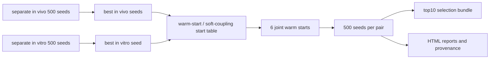

# 修订稿与结果包深度审阅报告

## 执行摘要

本次审阅基于三类材料展开：其一是用户当前会话中可直接访问并已成功解压的 `top10.zip`；其二是仓库 `thecloneredesignlab/miningcloneid` 的 `HypoxiaLTEEFigures` 分支及其 `oxygen` 工作流代码、配置与手稿源码；其三是手稿 `ltee_hypoxia_model.tex`。仓库文档表明，该项目是一个以 R 为核心的拟合与报告工作流，支持 separate in vivo、separate in vitro 和 joint fitting，并通过统一 runner、HPC submitter、可视化脚本和 HTML 报告脚本组织输出。README 明确给出了主入口脚本、关键输出文件以及 joint soft coupling 的目标函数和 warm-start 机制。citeturn10view0turn3view0turn4view0turn19view0

从科学内容上看，这篇修订稿的核心贡献是：把匹配的 SUM159 体内与体外染色体数演化数据，放入同一个机制模型中联合分析，并允许部分参数在两个环境中“软耦合”而非强制相同。这个建模思路本身有明显新意，尤其是把资源限制、应激相关染色体错分离、WGD 以及错分离后代的倍性依赖生存过滤同时纳入一个框架。手稿也比较清楚地写出了研究设计、数据流与模型模块。citeturn20view0turn24view0turn25view0

但从“是否已达到可发表的修订稿标准”看，我的结论是 **仍需大修**。最关键的原因不是思想不成立，而是 **手稿文本、代码实现、结果归档、可复现性元数据之间存在多处实质性不一致**。其中至少有两处属于方法学级别的不一致：第一，代码与配置把 `alpha_o2` 和 `gamma_growth` 也纳入了 soft-coupled 参数集合，而手稿方法部分却把它们写成 hard-shared；第二，代码与 README 使用的是 Welsch 型饱和软惩罚，而手稿附录把 soft-coupling penalty 写成了简单二次项。这两点会直接影响读者对 joint fitting 机制的理解，因此必须修正。citeturn19view0turn10view0turn29view0

在结果可靠性方面，本地对 `top10.zip` 的重算审计给出了一个相对积极但有限的判断：若仅针对提供的 top10 结果子集，若干手稿中的关键定性甚至定量结论是可以重现的。例如，手稿关于“terminal severe-deprivation 4N lineage 上平均染色体数从 84.3 降到 80.8、direct hypoxia-origin dead burden 不超过约 1.7%”的说法，与 top10 中最低目标值 in vitro 结果完全一致；joint 结果中关于 `\lambda_max`、`p_misseg` 以及后代生存过滤强弱的方向性差异，也能由 top10 中六个 warm starts 的 pair-median 重算得到，并与手稿叙述相符。citeturn22view2turn24view1turn25view0turn22view4

不过，这种“局部可重现”不能替代完整可复现。手稿明确声称 separate in vivo 有 500 个 seeds，六组 joint warm starts 各有 500 个 seeds；而当前提供的 `top10.zip` 只保留了 separate in vivo 前 10、separate in vitro 前 10，以及 joint 每个 pair 前 10 的结果。也就是说，当前审计只能验证“top10 子集与手稿是否一致”，不能完整验证全部 500 或 3000 个种子的分布、排序稳定性与图中全量统计。手稿自身也承认 in vivo 拟合存在多个 response classes 且 objective 空间重叠，这进一步意味着不确定性展示必须更严格，而不能只给 narratively favored 的解释。citeturn24view1turn25view0

综合建议如下：如果这份稿件要进入下一轮审稿，作者首先应该把“文本—代码—结果”三者统一起来，补齐完整可复现信息，删除所有占位符和作者内部批注，并把 joint penalty、shared/soft-coupled 参数集合、图生成流程、数据与环境版本、伦理声明讲清楚。在这些问题修复之前，我不建议给出接收或小修意见。citeturn20view0turn29view0turn30view0turn30view1turn30view2

## 审计范围与输入状态

本次实际成功获取并审计的输入如下：`prompt.md` 与 `top10.zip` 来自当前会话本地文件；仓库代码与手稿来自 GitHub 上 `HypoxiaLTEEFigures` 分支；`joint_pre.zip` 虽然用户说明已放入 `LTEE_results`，但本会话没有可用的 File Library 检索上下文，因此 **未能在运行时取回并解压该文件**。这意味着与 warm-start 前处理直接相关的那部分独立压缩包，本次只能通过 `top10.zip` 中已经复制进每个 joint seed 目录的 `joint_soft_coupling_parameters_table_input.csv` 等替代文件进行部分审计，而不能给出 `joint_pre.zip` 的完整目录树摘要。仓库文档则说明了 warm-start 表的标准生成方式和默认命名规则。citeturn10view0turn4view0

`top10.zip` 解压后的总体结构很清晰：根目录下有 `top10_index.tsv`，以及三个结果组目录，分别对应 separate in vivo、separate in vitro 和 multi-warmup joint fitting。就本地审计而言，`fit_invivo_O2_buffering_500seed` 含 10 个 seed 目录，`fit_invitro_O2_buffering_500seed` 含 10 个 seed 目录，而 `fit_joint_multi_warmup_tsne_sigmaN0p1216_objmin_500seed_20260714_021540` 下有 6 个 pair 目录，每个 pair 目录中保存前 10 个 seed 的详细输出。这个组织方式与 README 中“`<out_root>/<run_prefix>/seed<seed>/`”的目录范式一致，joint runner 还会在 pair-run 目录下写入配置快照、manifest、命令和 provenance 信息。citeturn10view0turn3view0turn14view0

```text
top10/
├── top10_index.tsv
├── fit_invivo_O2_buffering_500seed/
│   ├── seed25/ ... seed392/ 共10个
├── fit_invitro_O2_buffering_500seed/
│   ├── seed10/ ... seed464/ 共10个
└── fit_joint_multi_warmup_tsne_sigmaN0p1216_objmin_500seed_20260714_021540/
    ├── fit_joint_tsne_vi_seed138_C03Sc01_vt_seed10/
    ├── fit_joint_tsne_vi_seed25_C02Sc01_vt_seed10/
    ├── fit_joint_tsne_vi_seed290_C01Sc02_vt_seed10/
    ├── fit_joint_tsne_vi_seed311_C03Sc02_vt_seed10/
    ├── fit_joint_tsne_vi_seed322_C02Sc02_vt_seed10/
    └── fit_joint_tsne_vi_seed366_C01Sc01_vt_seed10/
```

从仓库工作流角度，可以把整个结果生成过程概括为下面这个流程。README 明确说明了 separate fit、joint fit、warm-start、HPC submitter、报告渲染和 soft-coupling 的基本关系；手稿也表述了同一机制模型在体内和体外数据上的联合评价逻辑。citeturn10view0turn20view0turn24view1



`prompt.md` 本身没有给出正式的数值打分 rubric，但它非常明确地要求：要写出 executive summary；要总结目录树和关键文件；要从代码层面解释文件含义；要做尽可能可行的复现或复现实审计；要按 peer-review 维度评价 novelty、methodology、experiments、results、figures/tables、clarity、reproducibility、ethical considerations；最后还要给作者可执行的 major/minor comments 和优先级清单。因此，下文我会在没有官方 rubric 的情况下，采用一个“审稿人自定义执行 rubric”来组织意见。  

## prompt要求提取

按照 `prompt.md` 与用户后续明确任务，本次输出的硬性要求可以归纳为四类。

第一类是**材料层面的要求**：需要解包结果文件；总结目录树；识别关键文件；用仓库代码解释目录与文件含义；若可行则运行或追踪代码。第二类是**审稿层面的要求**：不仅要看结果是否“看起来合理”，还要对论文的新颖性、方法学、实验设计、结果呈现、图表叙事、清晰性、可复现性和伦理合规分别给出评价。第三类是**交付格式要求**：必须有 executive summary、详细发现、文件→代码→含义映射表、复现实审计表、建议命令、依赖列表、缺失信息说明。第四类是**信息源优先级要求**：以仓库代码和原始结果为最权威来源，外部叙述服从代码。  

需要特别指出的是：`prompt.md` 并没有提供正式的 1–10 分或 accept/minor/major/reject 的打分标准。换言之，它要求“像审稿一样严谨”，但没有给期刊制式评分表。因此，我在本报告中采用的是一个**分析者自建 rubric**：以“是否支持发表”为主判据，以 major revision 作为最终建议，并辅以分维度质性评分。这一点应当在最终交付中说清楚，以免把“本报告的评分”误写成“prompt 原文规定的评分”。

在标准的审稿执行上，我建议把本次任务视为一个“三层一致性检查”：一是**概念一致性**，即手稿说了什么机制；二是**代码一致性**，即代码实际如何实现；三是**结果一致性**，即提供的 top10 输出是否真的支持这些叙述。对这篇稿件来说，这三层检查尤其重要，因为 joint fitting 的 biological interpretation 完全依赖于 soft coupling 的具体实现，而这里恰好存在手稿与代码的不一致。citeturn22view4turn29view0turn19view0

## 结果文件与代码映射

下面的映射表只覆盖 `top10.zip` 中确实出现、且在代码或仓库文档中能定位到含义的文件。对于 runner 级别的快照文件，如 `run_provenance.tsv`、`run_effective_args.tsv`、`config.resolved.yaml`、`fit_command.txt` 等，虽然本次未能直接打开 shell runner 源码，但 README 已说明 runner 会在 seed 目录下做配置快照并进一步运行 fitting、visualization 与 report；而本地文件内容也能直接证明这些文件属于 provenance/snapshot 层。citeturn10view0turn15view2

| 结果类别 | 文件 | 生成脚本 | 文件含义 |
|---|---|---|---|
| separate in vivo | `fit_summary.tsv` | `o2_supply_demand_map_fit_invivo_backend.R` | 该 seed 的目标函数分解、优化器状态、超参数、观测项数量与关键配置摘要。citeturn13view3turn14view2 |
| separate in vivo | `best_params.tsv` | `o2_supply_demand_map_fit_invivo_backend.R` | 最优自然尺度参数表。citeturn26view3 |
| separate in vivo | `fit_parameter_stages.tsv` | `o2_supply_demand_map_fit_invivo_backend.R` | 变换后参数在哪个优化阶段被更新；当前结果中为 `single_stage`。citeturn26view3 |
| separate in vivo | `single_stage_pass_summary.tsv` | `o2_supply_demand_map_fit_invivo_backend.R` | 单阶段优化 pass 的 objective 分解日志。citeturn26view4 |
| separate in vivo | `burden_fit.tsv` | `o2_supply_demand_map_fit_invivo_backend.R` | 肿瘤 burden 观测与预测对照，包括 live/dead 体积拆分。citeturn13view0 |
| separate in vivo | `terminal_ploidy_fit.tsv` | `o2_supply_demand_map_fit_invivo_backend.R` | 终点可存活细胞染色体数分布预测与观测计数。citeturn13view1 |
| separate in vivo | `necrosis_fit.tsv` | `o2_supply_demand_map_fit_invivo_backend.R` | 终点坏死比例拟合表；但在当前结果里预测列存在缺失，属实现/导出缺口。citeturn13view2 |
| separate in vivo | `deoptim_result.rds` / `fit_config.rds` | `o2_supply_demand_map_fit_invivo_backend.R` | 优化器对象与持久化配置对象。citeturn13view0 |
| separate in vitro | `best_params.tsv` / `best_params_transformed.tsv` | `o2_supply_demand_map_fit_invitro_backend.R` | 分别是自然尺度与变换尺度的最优参数。citeturn14view1 |
| separate in vitro | `invitro_lineage_summary.tsv` | `o2_supply_demand_map_fit_invitro_backend.R` | 每个 passage/segment 的增长、预测 live cells、预测平均染色体数与对应观测摘要。citeturn13view5turn14view1 |
| separate in vitro | `invitro_growth_loglik.tsv` / `invitro_ploidy_loglik.tsv` / `invitro_flow_loglik.tsv` | `o2_supply_demand_map_fit_invitro_backend.R` | 三个 in vitro likelihood 组成项的明细。citeturn13view5turn13view6 |
| separate in vitro | `invitro_flow_overlay.tsv` | `o2_supply_demand_map_fit_invitro_backend.R` | 预测 flow-density 与观测网格的叠加对照。citeturn13view5 |
| separate in vitro | `invitro_distribution_summary.tsv` / `invitro_distribution_quantiles.tsv` | `o2_supply_demand_map_fit_invitro_backend.R` | 可存活染色体数分布的全分布摘要与分位数。citeturn13view5turn14view1 |
| separate in vitro | `invitro_daily_counts.tsv` | `o2_supply_demand_map_fit_invitro_backend.R` | 每个 segment 的逐日 live/dead counts 与 burden 组成。citeturn13view4 |
| separate in vitro | `invitro_observed_kary.tsv` / `invitro_observed_flow.tsv` | `o2_supply_demand_map_fit_invitro_backend.R` | 原始观测在整理后的报告/对照格式中的导出。citeturn13view4turn13view6 |
| joint seed | `best_params_transformed.tsv` | `write_joint_outputs` in joint backend | joint optimizer 的变换尺度最优参数。citeturn14view0 |
| joint seed | `best_params.tsv` | `write_joint_outputs` in joint backend | joint 解对应的 **in vivo 自然尺度** 参数。citeturn14view0 |
| joint seed | `invitro_effective_params.tsv` | `write_joint_outputs` in joint backend | 同一 joint 解在 **in vitro 侧实际生效** 的自然尺度参数。citeturn13view8turn13view9 |
| joint seed | `joint_best_params_long.tsv` | `write_joint_outputs` in joint backend | 把 in vivo shared 参数与 in vitro effective 参数展开在同一长表中，便于比较。citeturn13view8turn14view0 |
| joint seed | `joint_params_shared.tsv` / `joint_params_invivo_only.tsv` / `joint_params_invitro_only.tsv` | `write_joint_outputs` in joint backend | 按共享、仅体内、仅体外三种参数作用域拆分。citeturn13view8turn14view0 |
| joint seed | `joint_soft_coupling.tsv` | `write_joint_outputs` in joint backend | 每个 soft-coupled 参数的 center、delta、vivo/vitro 自然值、fold-change、惩罚支付与可行性。citeturn13view7turn14view0 |
| joint seed | `joint_soft_coupling_projection.tsv` | `write_joint_outputs` in joint backend | soft-coupled 参数在 bounds 内的投影/可行性检查详情。citeturn13view7turn14view0 |
| joint seed | `joint_shared_bounds.tsv` | `write_joint_outputs` in joint backend | separate in vivo / in vitro bounds 合并后的 joint union bounds。citeturn13view7turn14view0 |
| joint seed | `invivo_burden_fit.tsv` / `invivo_terminal_ploidy_fit.tsv` / `invivo_necrosis_fit.tsv` | `write_joint_outputs` in joint backend | joint 解下对应的 in vivo 预测输出。citeturn14view0 |
| joint seed | `joint_components.tsv` | joint backend | joint objective、constraint、soft-coupling penalty 及参数级 penalty 分解。citeturn27view2 |
| joint seed | `parameter_table_input_invivo.csv` / `parameter_table_input_invitro.csv` | joint backend | 复制进入 seed 目录的输入参数表快照。citeturn27view3turn27view4 |
| joint seed | `joint_soft_coupling_parameters_table_input.csv` | joint backend | warm-start soft-coupling 初始值表输入快照。citeturn27view1turn27view3 |
| joint seed | `joint_soft_coupling_initial_values.tsv` / `joint_warmup_initial_values.tsv` | joint backend | 记录 start table 与 warmup 对优化初值的实际写入。citeturn27view0turn27view1 |
| 所有 fit 类型 | `report/fit_report_seed*.html` | `render_fit_report.R` | HTML 报告；脚本会按 seed 命名，可以渲染 HTML，并在条件满足时渲染 PDF。citeturn28view1turn28view2 |
| runner / provenance | `run_provenance.tsv` / `run_effective_args.tsv` / `config.resolved.yaml` / `fit_command.txt` / `run_command.txt` / `fit_array_manifest.tsv` | runner 层 | 运行环境、git 信息、CLI/配置快照、提交与分发信息。README 说明 runner 会进行 config snapshot 并继续执行拟合/可视化/报告。citeturn10view0turn3view0 |

一个重要的补充发现是：`top10.zip` 更像一个“筛选后的结果归档”，而不是可直接二次渲染的完整 run directory。报告脚本在判定 fit 目录时要求存在 `fit_summary.tsv`、`best_params.tsv` 和 `viz/` 目录；但当前 bundle 中大多数 seed 目录只保留了 HTML report，而没有保留完整 `viz/` 目录。也就是说，作者当前提供的不是“全量可重复生成报告”的结果树，而是“已经生成完报告后再筛选压缩”的结果树。这对读者来说可以浏览，但对重新渲染图/报告并不充分。citeturn15view2

## 可复现性与数值核查

从仓库文档可以提炼出一个相当明确的复现骨架。项目依赖 R 包 `Matrix`, `Rcpp`, `DEoptim`, `yaml`, `dplyr`, `tidyr`, `ggplot2`, `readxl`, `readr`, `data.table`, `patchwork`, `cowplot`, `ggh4x`, `ggalluvial`, `ggrepel`, `gridExtra`, `rmarkdown`, `magick`, `base64enc`, `testthat`；separate in vivo、separate in vitro 和 joint fitting 的 runner 与 submitter 命令都已在 README 中写明，config 默认文件为 `oxygen/config/O2_supply_demand.yaml`。README 还明确说明了 joint objective 的四个组成项，以及 warm-start 表由 `make_joint_soft_coupling_parameters_table.R` 生成的方式。citeturn10view0turn19view0

就“当前环境能否完整复现”而言，答案是：**不能完整执行，只能做高质量 reproducibility audit**。原因有三。第一，本会话运行环境没有可用 R 解释器，因此无法直接运行 repo 中的 R 工作流。第二，`joint_pre.zip` 未能在本轮会话中取回，因此无法独立审计该压缩包里的前处理文件树。第三，当前 `top10.zip` 只包含 top10 子集，而不是作者声称的全部 500/3000 个 seeds。因此，本次最合理的做法不是声称“我已完整复现”，而是提供精确到脚本、命令、输入和预期输出的复现实清单，同时利用已交付结果做局部数值核查。citeturn10view0turn24view1turn25view0

如果作者要让第三方真正一键复现，至少应公开或补齐以下信息：  
其一，**确切代码版本**。当前结果中的 provenance 显示 separate in vivo 与 joint 结果来自 `soft_coupling` 分支的不同 commits，而本次可审仓库是 `HypoxiaLTEEFigures` 分支；这意味着“代码仓库当前可见版本”与“结果实际生成版本”并不天然等价。其二，**完整运行环境**，至少要给出 `sessionInfo()`、R 版本、包版本锁定文件、Slurm/CPU 配置。其三，**原始输入数据快照**，包括 `data/InVivoData_Gemcitabine` 下 Excel/CSV 文件、`fit_objects_dir`、`flow_density_path`，以及 separate in vitro 缺失的 provenance 与命令快照。其四，**完整 seed 级结果或用于图表的中间统计**，否则读者无法审计 Figure 4–6 的全部分布。  

建议作者在补充材料中明确给出以下命令模板，作为复现入口。第一条用于 separate in vivo，第二条用于 separate in vitro，第三条用于 joint warm-start，第四条用于 HPC production run。它们都直接来自 README 或结果中记录的命令快照，因此已经足够接近“论文对应实际执行流程”。citeturn10view0turn3view0turn4view0

```bash
# separate in vivo
bash oxygen/code/O2_supply_demand_MAP/runner/run_fit_model_O2_supply_demand_MAP.sh \
  --fit_invivo \
  --mode=run \
  --config=oxygen/config/O2_supply_demand.yaml \
  --out_root=oxygen/results \
  --run_prefix=fit_invivo_O2_buffering_500seed \
  --append_run_prefix_timestamp=FALSE \
  --seeds_csv=25 \
  --n_cores=22 \
  --auto_viz=TRUE

# separate in vitro
bash oxygen/code/O2_supply_demand_MAP/runner/run_fit_model_O2_supply_demand_MAP.sh \
  --fit_invitro \
  --seed=1 \
  --out_dir=oxygen/results/fit_invitro_example/seed1 \
  --parameter_table=oxygen/data/O2_supply_demand/parameter_table_invitro_buffering.csv \
  --fit_objects_dir=oxygen/ploidyOxygen/data/fit_objects \
  --flow_density_path=oxygen/data/g0g1_ploidy_density_grid.csv \
  --itermax=500 \
  --NP=80 \
  --n_cores=1

# joint warm-start
Rscript oxygen/code/O2_supply_demand_MAP/analysis/warm_start/make_joint_soft_coupling_parameters_table.R \
  --invivo-seed-dir oxygen/results/fit_invivo_O2_buffering_500seed/seed366 \
  --invitro-seed-dir oxygen/results/fit_invitro_O2_buffering_500seed/seed10 \
  --seed-label tsne_vi_seed366_C01Sc01_vt_seed10

bash oxygen/code/O2_supply_demand_MAP/runner/run_fit_joint_model_O2_supply_demand_MAP.sh \
  --mode=run \
  --config=oxygen/config/O2_supply_demand.yaml
```

在局部数值核查方面，本地对 `top10.zip` 的重算结果有几个非常有价值的结论。首先，手稿关于 in vitro terminal severe-deprivation 4N line 的陈述是可重现的：top10 中最低 objective 的 separate in vitro seed 显示，4N 终末 severe-deprivation O1 lineage 的预测平均染色体数从约 84.3 逐步下降到约 80.8；同一路径上 direct hypoxia-origin dead burden 占总 burden 的最大比例约为 1.71%，与手稿“at or below 1.7%”的表述一致，差异只在四舍五入层面。手稿对此的科学解释也与模型结构一致：并非“高倍体被大规模直接杀死”，而是 buffering 使部分来自高倍体母细胞的 chromosome-loss daughters 仍可存活，从而导致向较低倍性重新整形。citeturn24view0turn22view2turn25view0

其次，joint 结果中关于“体内比体外具有更低的有效增殖上限、更强的 stress-linked missegregation、以及更强的倍性依赖 post-missegregation survival filter”的三条主结论，在 top10 子集上可被定量重算支持。基于六个 warm starts 各自前 10 个 joint seeds 的 pair-median，本地重算得到：`lambda_max` 的 in vivo/in vitro 比值在约 0.099–0.222 之间；`p_misseg` 的对应比值约为 11.1–47.4；按手稿附录公式计算的 per-copy survival gradient `S_88 - S_44` 在 in vivo 中约为 0.006–0.186，而体外固定在约 0.633。这与手稿 Figure 5 对三条 context-specific axes 的叙述高度一致。用于这些重算的错分离概率和后代生存公式都写在手稿附录中，而 soft-coupling 参数和自然尺度值则可直接从 joint 输出表中读出。citeturn24view1turn22view4turn22view1

再次，手稿关于“高氧下状态依赖性更明显”的陈述也能从 top10 子集中得到支持。用附录中的 `p_mis(N,O_2)` 公式重算 pair-median 后，可以看到在 5% O₂ 条件下，六个 joint pairs 在 `N=88` 时的 in vivo/in vitro missegregation ratio 全部大于 1，而在 `N=44` 时只有三组大于 1。这说明“高染色体数状态仍然保留体内增强的 stress-linked CIN，而近二倍体状态并非在所有 pair 中都如此”这一更细粒度的机制解释，不是空泛叙述，而是能够从当前结果文件直接推导出来。citeturn22view1turn24view1

与此同时，本地核查也暴露出几个严肃缺口。最明显的是 `necrosis_fit.tsv` 在当前 separate in vivo top10 中存在预测列空缺，这意味着即便 `fit_summary.tsv` 里给了 necrosis objective 和计数，单靠导出的 TSV 仍不足以复核坏死拟合曲线本身。这会让第三方审稿人或读者无法直接从结果包中重建坏死面板。第二，separate in vitro top10 缺少与 in vivo/joint 对应的 `run_provenance.tsv` 和 `fit_command.txt`，导致体外结果的 exact execution trace 不完整。第三，部分结果显示优化器实际使用的 `NP_used` 大于请求值 `NP_requested`，这提示代码里存在未在手稿中充分说明的自动放大规则。上述问题共同表明：当前结果包适合“浏览与局部核对”，但不足以支撑“第三方端到端复现”。  

## 同行评审结论与作者清单

我的综合判断是：**科学问题重要，建模框架有新意，局部结果支持度不错，但稿件目前仍处于“大修后再审”阶段**。如果需要一个自建评分表，我会给出如下判断：新颖性 7/10，方法潜力 8/10，结果支持度 6/10，清晰性 4/10，可复现性 4/10，伦理与报告完整性 4/10；总体建议为 **Major Revision**。这一判断的核心不是“结论一定错”，而是“作者还没有把读者说服到可以独立检查并信任所有关键环节”。  

最严重的问题如下表所示。

| 严重性 | 问题 | 证据 | 建议 |
|---|---|---|---|
| 重大 | **手稿与代码对 soft coupling 的定义不一致**：代码/配置把 `alpha_o2` 和 `gamma_growth` 也列入 soft-coupled 参数，但手稿方法段写它们是 hard-shared。 | 配置与 README 的 `joint_soft_coupling_params` 明确包含 `alpha_o2,gamma_growth`；joint 初值输入表也包含这两个参数的 `delta__` 项。手稿附录却把二者写成 hard-shared。citeturn19view0turn10view0turn29view0 | 必须统一：要么改代码，要么改手稿；二者必须完全一致。最好在 Methods 增加一个表，逐项列出 hard-shared、soft-coupled、context-specific-only 参数。 |
| 重大 | **手稿附录中的 soft penalty 公式与代码实现不一致**。附录写的是二次惩罚，代码与 README 使用的是 Welsch 饱和惩罚。 | README 与代码都写明 Welsch-style penalty、`sigma_default=0.65`、`c=0.4`；手稿 Eq. `appendix_joint_soft_penalty` 却是 `1/2 sum(delta/sigma)^2`。citeturn10view0turn4view0turn29view0 | 必须改正文与附录公式，并解释为什么选 Welsch 而不是二次惩罚；最好补一个 sensitivity/ablation。 |
| 重大 | **手稿仍保留占位符和内部批注**，说明文本层面尚未准备好送审。 | 引言仍有多个 `XX:` 段落；附录还有 “XX -- I disagree with this assumption -->” 这样的作者内部注释。citeturn20view0turn29view0 | 全面清理占位符、批注、草稿语气和未完成引用。 |
| 重大 | **结果 provenance 与可审仓库版本不完全对齐**。 | 结果元数据显示生成时使用的是 `soft_coupling` 分支上的不同 commits，而当前公开审查的是 `HypoxiaLTEEFigures` 分支；其中还有 `dirty_status=dirty`。 | 在补充材料中给出精确 commit、分支、tag 或 release；若结果不是由当前公开分支生成，必须提供结果对应版本的永久链接或归档。 |
| 重大 | **结果包不是完整可重放归档**。 | report 脚本要求 fit 目录含 `viz/` 目录，但当前 bundle 主要只保留 HTML report；`joint_pre.zip` 本轮也不可得。citeturn15view2 | 提供一个完整、可重新渲染报告与图件的 results tarball，或补充一个 Snakemake/Makefile 式复现入口。 |
| 中等 | **坏死结果导出不完整**。 | in vivo 输出写了 `necrosis_fit.tsv`，但当前结果中的预测列存在缺失，使坏死面板无法仅依靠导出表独立核查。citeturn13view2turn13view3 | 修复导出逻辑，或提供生成 necrosis panel 的中间对象与脚本。 |
| 中等 | **体外结果缺少与体内/joint 对称的 provenance 文件**。 | separate in vitro top10 中未发现 `run_provenance.tsv`、`fit_command.txt`。 | 补齐 separate in vitro 的执行命令、git 信息和环境快照。 |
| 中等 | **手稿对不确定性的处理仍不够克制**。 | 手稿自己承认 500 个 in vivo fits 存在多个 response classes 且 objective 空间重叠，但主文叙事仍容易给人“机制已唯一确定”的印象。citeturn24view1turn25view0 | 在 Results 和 Discussion 中改用更谨慎措辞，例如 “within the current model class” “one supported regime is …” “multiple regimes remain competitive”。 |
| 中等 | **伦理与合规陈述缺失**。 | 当前手稿未检索到 IACUC/animal ethics/approval 等表述，而方法明确使用 orthotopic tumor 数据。citeturn20view0turn30view0turn30view1turn30view2 | 补写动物实验审批与数据合规声明。 |

除了上述 major issues，我还建议作者处理以下 minor issues。第一，术语要更统一，例如 “hypoxia/resource stress”“oxygen as proxy”“effective O₂” 这些概念在不同段落中应严格区分“直接测量量”和“模型隐变量”。第二，建议在主文或补充中加入一个“输出文件说明表”，把 `fit_summary.tsv`、`joint_soft_coupling.tsv`、`joint_components.tsv` 等结果文件的列名含义说明清楚，这样读者就不必反向读代码。第三，建议把 separate in vivo 的独立拟合质量指标直接写进正文或补充，而不是只把 objective 放在结果目录中；例如本地对 top10 的独立审计显示，equal-weighted log-burden RMSE、terminal chromosome distribution 的 mean absolute error、Wasserstein-1 与 total variation 都能给出很有用的拟合质量摘要。第四，Figure 5 如果是论文叙事核心，最好在正文中补一个小表，直接列出六个 pair 的 `lambda_max`、`p_misseg`、`s_max` / `buffer_beta` / `n_exp` 的 pair-median ratio，而不是把这些信息完全留给图。  

最后给出一个我建议作者按优先级执行的清单。

| 优先级 | 作者应完成的动作 |
|---|---|
| 最高 | 统一手稿、配置、代码中关于 soft-coupled 参数集合与 penalty 形式的所有描述。 |
| 最高 | 删除所有 `XX:` 占位、内部批注和未完成段落。 |
| 最高 | 提供结果对应的精确代码版本、R 版本、包版本、输入数据快照和完整运行命令。 |
| 很高 | 补交完整结果归档，至少包含 `viz/`、figure 生成中间文件、完整 seeds 或可重建图表的 summary tables。 |
| 很高 | 修复 `necrosis_fit.tsv` 导出，确保坏死图可以独立复核。 |
| 很高 | 在手稿中增加一个“参数共享/软耦合/仅上下文参数”对照表。 |
| 中高 | 在 Results 与 Discussion 中把机制性结论改写为“当前模型支持的解释”，并显式讨论多解性。 |
| 中高 | 补充伦理审批与动物实验合规声明。 |
| 中等 | 为主要结果加入更直接的数值摘要表，而不只依赖图。 |
| 中等 | 为结果目录提供一页“文件说明书”，方便第三方审阅与复现。 |

如果作者完成以上修改，这篇稿件的潜力是明显存在的：其核心问题重要，模型结构有辨识度，top10 子集审计也表明主要生物学叙事并非“纯讲故事”。但在当前状态下，最大的障碍不是模型本身，而是 **方法描述不严丝合缝、归档不够完整、复现链条还没有闭合**。这正是我建议大修而非接收的根本原因。