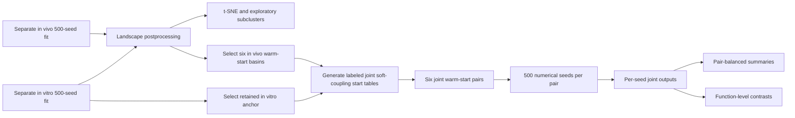
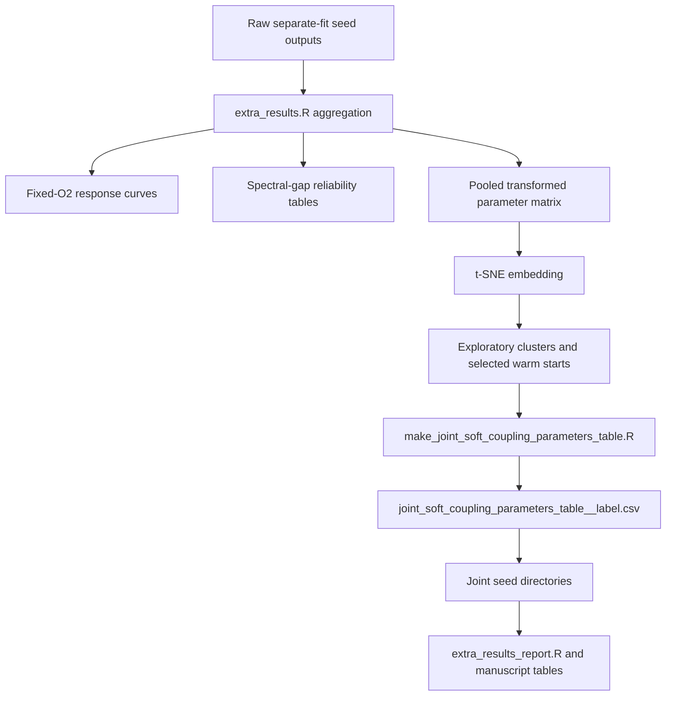

# Review of the Submitted LTEE Hypoxia Manuscript and the Supplied Joint-Fitting Results

## Executive summary

I reviewed the uploaded `prompt.md`, the supplied `top10.zip` result bundle, the submitted manuscript text, and the public repository code and workflow documentation for the oxygen/ploidy fitting pipeline. The most important conclusion is that the **core qualitative joint-fit claims are directionally supported by the supplied top-ranked solutions**, but the package is **not yet sufficient for a fully reproducible audit of the manuscript’s strongest landscape-level claims**, especially those that depend on the full 500-seed separate in vivo search, fixed-O₂ attractor postprocessing, spectral-gap reliability summaries, t-SNE clustering, and warm-start selection preprocessing. The repository documentation explicitly expects additional postprocessing through `extra_results.R` and `extra_results_report.R`, and the joint workflow depends on a generated soft-coupling start table from `make_joint_soft_coupling_parameters_table.R`; those aggregated outputs are not present in `top10.zip`. citeturn22view1turn24view2

Among the claims that **are** well supported by the supplied archive, the strongest are these. The separate in vitro solutions consistently show that the 4N lineage can decline under severe oxygen deprivation **without requiring much direct hypoxia-origin death**, because the fitted stress-associated death and growth-penalty parameters sit at their lower bounds in all top-ten in vitro fits, while the lineage still shifts downward in chromosome number through the chromosome-transition/survival machinery. This qualitative mechanism is consistent with the manuscript’s interpretation of the deprived 4N branch. The mechanistic formulas used for this interpretation are exactly the ones stated in the model description: oxygen stress enters through the Hill function \(h(O_2)\), modulates \(\lambda_{\mathrm{eff}}\) and \(\mu_{\mathrm{eff}}\), raises \(p_{\mathrm{mis}}(N,O_2)\), and passes daughter states through a ploidy-dependent post-missegregation survival filter \(S_N(\Delta)=s_N^{|\Delta|}\). citeturn20view0turn19view3turn18view0

The **joint-fit directional contrasts** claimed in the submitted manuscript are also reproduced from the supplied joint top-ten sets. Across the six retained joint warm-start pairs, the pair-median in vivo/in vitro ratio for \(\lambda_{\max}\) falls in the manuscript-reported range; the direction is consistent in all six pairs, with lower fitted \(\lambda_{\max}\) in vivo. Likewise, the pair-median in vivo/in vitro ratio for \(p_{\mathrm{misseg}}\) is consistently above one across all six pairs, and two pairs visibly sit at the in vivo upper bound for that parameter, exactly the kind of boundary-limited interpretation the manuscript says should be handled cautiously. The submitted manuscript explicitly frames these contrasts as **conditional on the fitted model and sampled basins**, not as direct biological measurements, which is the right framing. fileciteturn0file0

The main problems are methodological and reproducibility-related. First, **the preprocessing chain for joint fitting is only partially auditable** in the supplied files: the per-seed applied warm-start tables and soft-coupling start tables are present and internally consistent, but `joint_pre.zip` itself was not accessible in this session, and the upstream t-SNE / subcluster / warm-start selection products are not included in `top10.zip`. Second, **the manuscript’s strongest fixed-O₂ selection arguments are not independently reproducible from the supplied bundle**, because no spectral-gap tables, response-curve tables, AUC summaries, or aggregated `extra_results` outputs are included, even though the workflow documentation says those are expected. Third, **the result package reveals several technical red flags**: every joint solution has active bounds; separate in vivo fits often pile onto bounds as well; all joint local refinements were attempted but none were accepted; and the necrosis prediction export files contain missing predicted values despite a nonzero necrosis objective term. These do not automatically invalidate the manuscript, but they materially limit how strongly the authors should claim quantitative mechanistic identification. citeturn22view1turn24view2

My overall recommendation is therefore **major revision, not rejection**. The manuscript already contains many of the right caveats, and the supplied top-ranked solutions do support the central directional claims. But the deposited result package is incomplete for independent review of the full argument, and several claims should be tightened so that the paper consistently emphasizes **broad, basin-stable, model-conditional contrasts** rather than exact parameter estimates or globally identified mechanisms. fileciteturn0file0

## Scope and evidence base

The uploaded prompt imposes a very specific review standard. In practical terms, it asks the review to do four things at once: audit the manuscript’s claims against the actual code and outputs, test whether separate in vivo fitting really supports only broad patterns rather than exact parameter values, ensure that joint-fit claims are explicitly basin-limited and non-causal, and insist that any fixed-O₂ attractor interpretation be presented cautiously because of spectral-gap limitations. That standard is appropriate for this result set.

The evidence I could directly use in this session consisted of four source classes. First, the submitted manuscript text itself. Second, the uploaded `top10.zip` archive, which contains top-ranked separate in vitro, separate in vivo, and joint-fit seed directories. Third, the repository code and workflow documentation on GitHub, especially the oxygen workflow README, the config file, and the three fit backends. Fourth, the repository manuscript draft, which was useful mainly to detect documentation drift between code and manuscript versions. The oxygen workflow README identifies the unified optimizer entry point, the shell runners, the HPC submitter, the expected seed-directory output structure, the start-table generation step for warm-started joint fits, the contents of joint soft-coupling outputs, and the expected postprocessing via `extra_results.R`. citeturn22view1turn24view2turn13view0

One important limitation needs to be stated plainly. I **could not directly access `joint_pre.zip` from the user’s library in this session**, so my preprocessing audit is limited to the preprocessing artifacts that were copied into the joint seed directories inside `top10.zip`: `joint_soft_coupling_parameters_table_input.csv`, `joint_soft_coupling_initial_values.tsv`, `joint_warmup_initial_values.tsv`, resolved configs, and provenance files. That is enough to verify the **last-mile handoff** into the joint optimizer, but not enough to independently reconstruct the full upstream t-SNE / clustering / warm-start selection pipeline.

A second limitation is that the repository manuscript draft is **not the same document as the submitted manuscript**. The repository draft still contains older wording and even an unfinished editorial comment in the joint-fitting section; specifically, it says `alpha_o2` and `gamma_growth` are hard-shared, whereas the current workflow documentation lists both among the soft-coupled parameters, and the submitted manuscript says all 14 overlapping active biological parameters were soft-coupled. That discrepancy matters because it shows that the manuscript under review is ahead of the public draft, while the code-side documentation already reflects the soft-coupled scheme. citeturn24view0turn24view2turn19view2

The prompt-oriented acceptance checklist below summarizes my judgment.

| Criterion from the uploaded prompt | Status | Assessment |
|---|---|---|
| Review the manuscript against code and actual outputs | **Partial pass** | Achievable for the supplied top-ranked fits and the public workflow, but not for all 500-seed postprocessing-dependent claims |
| Show that separate in vivo objective ranking alone does not uniquely identify exact parameters | **Pass** | Strongly supported by broad bound-hitting and high parameter spread across retained in vivo fits |
| Keep separate in vivo interpretation at the level of broad patterns / modes, not exact fitted truths | **Partial pass** | The submitted manuscript largely does this, but some results still need stronger deposit-backed support |
| Present joint-fit contrasts as basin-limited, model-conditional, and non-causal | **Pass** | The submitted manuscript already uses mostly appropriate cautionary language fileciteturn0file0 |
| Use function-level interpretation, not isolated parameter signs, for nonlinear mechanisms | **Pass** | The submitted manuscript’s survival-function interpretation is the right move, and the supplied joint fits support it |
| Keep fixed-O₂ attractor claims cautious because spectral gaps are often small | **Partial pass** | The manuscript says this; the deposited bundle does not include the underlying reliability tables needed for independent confirmation |
| Make preprocessing and warm-start selection auditable | **Fail** | Immediate start-table handoff is auditable, but the upstream `joint_pre.zip` / full preprocessing chain is not available here |
| Make the result package reproducible enough for external review | **Fail** | Missing `extra_results`, spectral-gap outputs, response-curve outputs, and half of the separate in vivo warm-start parents |

## Result-file provenance and preprocessing audit

The repository documentation is clear about the broad file-generation architecture. Separate in vivo runs are launched through the unified runner and produce per-seed directories containing `fit_summary.tsv`, `best_params.tsv`, transformed parameter tables, `fit_result.rds`, and optional visualization/report outputs. Separate in vitro runs likewise produce `fit_summary.tsv`, `best_params.tsv`, `best_params_transformed.tsv`, `fit_result.rds`, and in vitro report outputs. Joint runs execute joint fitting, then in vivo visualization, in vitro visualization, and joint HTML report rendering; the joint objective is defined as a weighted in vivo objective plus a weighted in vitro objective plus soft-coupling and constraint terms. The same README also states that the joint submitter first generates a labeled soft-coupling start table with `make_joint_soft_coupling_parameters_table.R`, passes that exact CSV into the joint run, records start-table provenance in `joint_soft_coupling_initial_values.tsv`, records warm-start provenance in `joint_warmup_initial_values.tsv`, and expects further aggregation in `extra_results.R`. citeturn22view1turn24view2

At the backend level, the provenance of the high-value output files is mostly unambiguous. The in vivo backend writes `fit_summary.tsv`, `burden_fit.tsv`, `terminal_ploidy_fit.tsv`, `necrosis_fit.tsv`, `deoptim_result.rds`, and `fit_config.rds`. It also writes `best_params.tsv`, `fit_parameter_stages.tsv`, and `single_stage_pass_summary.tsv`, so those files are clearly products of the in vivo optimizer’s finalization stage. The in vitro backend writes `invitro_lineage_summary.tsv`, `invitro_growth_loglik.tsv`, `invitro_ploidy_loglik.tsv`, `invitro_flow_loglik.tsv`, `invitro_flow_overlay.tsv`, `invitro_distribution_summary.tsv`, `invitro_distribution_quantiles.tsv`, `invitro_daily_counts.tsv`, `invitro_observed_kary.tsv`, `invitro_observed_flow.tsv`, `fit_summary.tsv`, and `fit_result.rds`. The joint backend writes `best_params.tsv`, `invitro_effective_params.tsv`, `joint_best_params_long.tsv`, `joint_params_shared.tsv`, `joint_params_invivo_only.tsv`, `joint_params_invitro_only.tsv`, `joint_soft_coupling.tsv`, `joint_soft_coupling_projection.tsv`, `joint_shared_bounds.tsv`, the three prediction tables `invivo_burden_fit.tsv`, `invivo_terminal_ploidy_fit.tsv`, `invivo_necrosis_fit.tsv`, the joint `fit_summary.tsv`, and the copied parameter/start-table snapshots. It also copies the exact seed-level soft-coupling parameter table input when one exists. citeturn9view0turn9view3turn9view5turn9view6turn10view0turn10view4turn10view5turn21view0turn21view2

A practical provenance map for the files that matter most is below.

| File or file family in `top10.zip` | Generating step | Meaning |
|---|---|---|
| `config.input.yaml`, `config.resolved.yaml`, `run_command.txt`, `run_effective_args.tsv`, `run_provenance.tsv` | runner / wrapper | Declared inputs, resolved CLI/config state, command invocation, and run environment |
| `parameter_table_input*.csv` | runner/backend snapshot | Natural-scale parameter specification actually used by that fit |
| `parameter_table.csv` | in vivo backend | Transformed optimizer parameter table snapshot written before optimization citeturn23view0 |
| `best_params.tsv`, `best_params_transformed.tsv` | backend finalization | Final best parameter values on natural and transformed scales |
| `fit_summary.tsv` | backend finalization | Scalar summary metrics: objective breakdowns, optimizer diagnostics, sample counts, and paths |
| `single_stage_pass_summary.tsv`, `fit_parameter_stages.tsv` | in vivo backend | Per-pass objective log and map of optimized transformed parameters for the single-stage optimizer path citeturn21view0turn21view1 |
| `burden_fit.tsv`, `terminal_ploidy_fit.tsv`, `necrosis_fit.tsv` | in vivo backend | Per-scenario prediction/fit tables for tumor burden, terminal ploidy, necrosis |
| `invitro_*` tables | in vitro backend | Per-lineage likelihood tables, distribution summaries, daily counts, and observed-vs-predicted summaries |
| `joint_best_params_long.tsv`, `joint_params_*.tsv` | joint backend | Joint parameter outputs split by scope and context |
| `joint_soft_coupling.tsv` | joint backend | Center/delta reconstruction, natural and transformed context-specific values, bounds, feasibility, penalties |
| `joint_soft_coupling_projection.tsv` | joint backend | Projection diagnostics for the soft-coupled parameterization |
| `joint_shared_bounds.tsv` | joint backend | Actual shared/joint admissible bounds used in the joint run |
| `joint_soft_coupling_parameters_table_input.csv` | copied by joint backend | The exact labeled soft-coupling start table used as the final init override citeturn21view2 |
| `joint_soft_coupling_initial_values.tsv` | joint backend | Applied start-table rows and bound-action checks |
| `joint_warmup_initial_values.tsv` | joint backend | Warm-start source values, transformed names, and bound actions |
| `invivo_burden_fit.tsv`, `invivo_terminal_ploidy_fit.tsv`, `invivo_necrosis_fit.tsv` inside joint seeds | joint backend | The in vivo predictions re-evaluated at the final joint-fit parameter set |
| `fit_report_seed*.html`, `report_status.log`, `viz_status.log` | report / visualization stage | Per-seed HTML report and associated stage logs |
| `top10_index.tsv` | packaging step | Bundle-level index of selected seeds and objectives; its exact packaging script is not exposed in the inspected repo |

The preprocessing audit is mixed but informative. The **good news** is that the immediate warm-start handoff into the joint runs looks internally consistent. Across all sixty supplied joint solutions, the copied `joint_soft_coupling_parameters_table_input.csv` values exactly match the corresponding applied warm-start entries for the soft-coupled optimizer variables, and every recorded row in both `joint_warmup_initial_values.tsv` and `joint_soft_coupling_initial_values.tsv` has `bound_action = inside`. This is exactly the behavior the README says should occur: start-table values are init overrides only, must already lie within bounds, and invalid rows should fail rather than be clipped. citeturn22view1

The **bad news** is that the package is still missing critical upstream provenance. Half of the six joint warm-start labels use separate in vivo seeds that are **not present** in the separate in vivo top-ten archive, so those parent solutions cannot be directly audited from `top10.zip`. In addition, the bundle contains no spectral-gap outputs, no oxygen-response-curve tables, no AUC-ranking tables, no pooled t-SNE coordinates, no clustering assignments, and no `extra_results` aggregation directory, even though the documented workflow expects those artifacts. I therefore consider the preprocessing chain **partially validated, not fully reproducible**. citeturn24view2

There is also a version-control concern. The supplied run provenance files point to a local repository path and to a branch named `soft_coupling`, while the public repository branch reviewed here is `HypoxiaLTEEFigures`. That alone does not prove a substantive mismatch, but it does mean the code path that produced the archived results is **not identical in a strictly auditable sense** to the public tree used for this review. The documentation mismatch noted above in the repository manuscript strengthens that concern.

## Reproduced summaries and model comparison

### Separate in vitro top-ten summary

The top-ten separate in vitro solutions are numerically very close. The objective range across the ten retained seeds is only about 0.0098 absolute units, from 3.8525 to 3.8623. All ten runs accepted local refinement, which contrasts sharply with the joint fits. The major variation inside the objective is in the tradeoff between karyotype and flow terms, not in a gross failure of fit.

| seed | objective | growth loglik | ploidy loglik | flow loglik | local accepted |
|---|---:|---:|---:|---:|---|
| seed10 | 3.852535 | 0.170596 | -3.096222 | -0.926910 | TRUE |
| seed132 | 3.853257 | 0.172301 | -3.094108 | -0.931450 | TRUE |
| seed81 | 3.854077 | 0.171404 | -3.097551 | -0.927930 | TRUE |
| seed294 | 3.859393 | 0.171972 | -3.101749 | -0.929616 | TRUE |
| seed337 | 3.859828 | 0.185067 | -3.117859 | -0.927036 | TRUE |
| seed106 | 3.860527 | 0.166738 | -3.114690 | -0.912575 | TRUE |
| seed317 | 3.860960 | 0.164257 | -3.125250 | -0.899967 | TRUE |
| seed140 | 3.861023 | 0.163744 | -3.149504 | -0.875263 | TRUE |
| seed285 | 3.861753 | 0.158284 | -3.133736 | -0.886302 | TRUE |
| seed464 | 3.862302 | 0.183390 | -3.124817 | -0.920875 | TRUE |

The key biological/mechanistic feature of the separate in vitro top-ten set is not microscopic objective ranking; it is the **boundary pattern**. In all ten top in vitro fits, `alpha_o2`, `gamma_growth`, `mu_hp`, and `gamma_mu` sit exactly at their lower bounds. That means the top in vitro fits consistently avoid invoking strong direct stress-linked death or strong chromosome-number-dependent stress penalties. This is fully consistent with the manuscript’s claim that the deprived 4N branch can decline without substantial direct hypoxia-origin killing. Under the model equations, if \(h(O_2)\)-mediated growth/death terms are minimized, the remaining ways to reshape lineage ploidy are missegregation, WGD routing, and the post-missegregation survival filter. citeturn20view0turn19view3turn18view0

The supplied archive supports that interpretation quantitatively. In the best separate in vitro seed, the terminal severe-deprivation 4N lineage’s predicted mean chromosome number declines from 84.34 to 80.76; across the ten retained in vitro fits, the corresponding decline spans 3.54 to 4.17 chromosomes. The direct hypoxia-origin dead burden fraction along that severe-deprivation lineage stays below about 1.8% in the best seed and below about 1.9% across the full top-ten set. These values match the manuscript’s reported range. fileciteturn0file0

The manuscript’s other major in vitro claim is also supported: the model misses the **late divergence of the two deprived 2N branches**. In the best retained in vitro fit, the paired late-stage O1/O2 2N observations differ by roughly 21 chromosomes in observed mean karyotype at a terminal zero-oxygen segment, while the model predicts the same value for both branches. This is a real miss, not cosmetic noise, and the manuscript is right to acknowledge it. fileciteturn0file0

### Separate in vivo top-ten summary

The top-ten separate in vivo solutions are likewise tightly clustered in objective value. The range is about 0.0555 objective units, from 14.1193 to 14.1748. All ten accepted local refinement. But unlike the in vitro case, the retained in vivo solutions show **substantial spread in several biological parameters**, including baseline missegregation, WGD probability, stress-linked missegregation increment, O₂ threshold, and death scale. This is exactly the pattern the prompt wanted the review to test: the objective can be nearly flat over substantially different parameter regimes.

| seed | objective | burden term | ploidy term | necrosis term | local accepted |
|---|---:|---:|---:|---:|---|
| seed25 | 14.119328 | 8.369818 | 4.761985 | 0.902673 | TRUE |
| seed366 | 14.134020 | 8.549988 | 4.803744 | 0.779212 | TRUE |
| seed292 | 14.137198 | 8.741345 | 4.759546 | 0.631068 | TRUE |
| seed392 | 14.140592 | 8.420926 | 4.735879 | 0.983788 | TRUE |
| seed90 | 14.152447 | 8.493944 | 4.728610 | 0.964931 | TRUE |
| seed391 | 14.155283 | 8.503432 | 4.714977 | 0.948669 | TRUE |
| seed264 | 14.155815 | 8.676146 | 4.699427 | 0.780242 | TRUE |
| seed109 | 14.172351 | 8.352603 | 4.702809 | 1.117556 | TRUE |
| seed322 | 14.172442 | 8.561892 | 4.825553 | 0.778582 | TRUE |
| seed26 | 14.174785 | 8.411987 | 4.772855 | 0.989944 | TRUE |

The retained in vivo top-ten set strongly argues against over-interpreting exact parameter values. Among the retained solutions, `p_mis_base` varies by more than three orders of magnitude, `p_wgd` varies by more than sixty-fold, `mu_hp` changes by nearly seventeen-fold, and `k_o_mis` by more than twelve-fold, while objective values remain nearly indistinguishable. At the same time, several parameters repeatedly accumulate on bounds: `sigma_burden` is at the upper bound in all ten fits, `lam_max` reaches its upper bound in four of ten, `p_misseg` reaches its upper bound in four of ten, `buffer_n_exp` reaches its upper bound in four of ten, and `alpha_o2` and `mu_hp` hit their lower bounds in three of ten. This is not what a strongly identified single-parameter regime looks like.

That finding is directly aligned with the submitted manuscript’s decision to interpret the separate in vivo landscape primarily in terms of **broad fixed-O₂ regimes and multiple compatible modes**, not exact fitted numbers. The manuscript’s discussion of spectral-gap reliability and of multiple oxygen–ploidy regimes is therefore methodologically appropriate in spirit. The problem is not the framing; the problem is that the supplied archive does not include the postprocessed attractor tables needed to independently verify the exact counts and AUC values. fileciteturn0file0

### Joint-fit comparison

The joint archive contains **six warm-start pairs**, each with ten retained seeds. The striking result is that the **top ten joint solutions overall all come from the same warm-start pair**, `vi366_C01Sc01-vt10`, whose best seed is `seed472`. The best joint objective is 18.852286. The second-best pair, `vi322_C02Sc02-vt10`, has a best objective of 18.890060. The worst retained pair is almost 1.13 objective units above the best pair, which is much larger than within-pair top-ten spreads for several pairs. That supports the manuscript’s own claim that **between-basin differences exceed within-pair numerical jitter** and should not be ignored. fileciteturn0file0

| joint warm-start pair | best objective | median objective | within-pair top10 range | median in vivo component | median in vitro component | median soft penalty | active bounds per solution |
|---|---:|---:|---:|---:|---:|---:|---:|
| vi366_C01Sc01-vt10 | 18.852286 | 18.860593 | 0.014341 | 14.133924 | 3.856049 | 0.868124 | 12 |
| vi322_C02Sc02-vt10 | 18.890060 | 18.913792 | 0.035513 | 14.165358 | 3.855466 | 0.893314 | 10–12 |
| vi25_C02Sc01-vt10 | 18.970464 | 18.972776 | 0.002496 | 14.145674 | 3.857724 | 0.969538 | 10–12 |
| vi311_C03Sc02-vt10 | 19.414487 | 19.426430 | 0.019723 | 14.197919 | 3.857466 | 1.370827 | 9–11 |
| vi290_C01Sc02-vt10 | 19.791314 | 19.798996 | 0.014209 | 14.082785 | 3.853329 | 1.862882 | 14 |
| vi138_C03Sc01-vt10 | 19.978236 | 20.013819 | 0.041007 | 14.177633 | 3.858492 | 1.977694 | 11–13 |

Two observations matter most here.

First, **all sixty joint solutions have active parameter bounds**, with a minimum of 9 active bounds and a median of 12. The most common bound hits are `sigma_burden` at the in vivo upper bound in all sixty solutions, `alpha_o2` and `mu_hp` at the in vitro lower bounds in all sixty, `buffer_smax` at the in vitro transformed upper bound in all sixty, and `gamma_growth` at the in vitro lower bound in fifty-nine of sixty. This is strong evidence that the joint solutions are boundary-limited, not freely exploring an interior optimum. That does not nullify the directional contrasts, but it absolutely limits effect-size interpretation.

Second, **the local optimizer never improved any joint solution**. In every joint retained seed, local refinement was attempted and not accepted. This differs sharply from the separate fits, where local refinement was always accepted in the retained top tens. The most conservative interpretation is that the retained joint solutions are essentially DE basin solutions with no successful local polishing.

The best overall joint seed is:

| pair | seed | total objective | in vivo component | in vitro component | soft-coupling penalty | DE iterations completed | local accepted | start-used flag |
|---|---|---:|---:|---:|---:|---:|---|---|
| vi366_C01Sc01-vt10 | seed472 | 18.852286 | 14.126421 | 3.858485 | 0.867380 | 56 | FALSE | FALSE |

The `optimizer_start_used = FALSE` flag is notable because the same seed directory also contains fully populated `joint_warmup_initial_values.tsv` and `joint_soft_coupling_initial_values.tsv` files. I would not call this a proven bug from the available evidence, but I would call it a **reporting inconsistency that should be explained**.

### Reproduced joint function-level contrasts

The manuscript is strongest where it moves from raw parameter contrasts to **function-level contrasts**. Using the manuscript’s own formulas for \(h(O_2)\), \(\lambda_{\mathrm{eff}}(N,O_2)\), \(\mu_{\mathrm{eff}}(N,O_2)\), \(p_{\mathrm{mis}}(N,O_2)\), and the post-missegregation survival factor \(s_N\), I recomputed pair-median contrasts for all six retained warm-start pairs. The formulas are exactly those stated in the model description. citeturn20view0turn19view3turn18view0

The key reproduced contrasts are:

| pair | \(\lambda_{\max}^{vivo}/\lambda_{\max}^{vitro}\) | \(p_{\mathrm{misseg}}^{vivo}/p_{\mathrm{misseg}}^{vitro}\) | \(p_{\mathrm{mis}}(44,0\%)^{vivo}/p_{\mathrm{mis}}(44,0\%)^{vitro}\) | \(p_{\mathrm{mis}}(44,1\%)^{vivo}/p_{\mathrm{mis}}(44,1\%)^{vitro}\) | \(s_{44}^{vivo}/s_{44}^{vitro}\) | \(s_{88}^{vivo}/s_{88}^{vitro}\) | \((s_{88}-s_{44})^{vivo}/(s_{88}-s_{44})^{vitro}\) |
|---|---:|---:|---:|---:|---:|---:|---:|
| vi290_C01Sc02-vt10 | 0.099 | 47.378 | 48.082 | 14.788 | 4.656 | 1.143 | 0.012 |
| vi138_C03Sc01-vt10 | 0.099 | 47.378 | 47.696 | 29.128 | 4.672 | 1.145 | 0.010 |
| vi25_C02Sc01-vt10 | 0.177 | 17.672 | 17.163 | 8.658 | 3.574 | 1.092 | 0.293 |
| vi366_C01Sc01-vt10 | 0.177 | 11.120 | 11.140 | 7.426 | 3.780 | 1.086 | 0.219 |
| vi322_C02Sc02-vt10 | 0.183 | 11.314 | 11.813 | 11.068 | 3.900 | 1.077 | 0.169 |
| vi311_C03Sc02-vt10 | 0.222 | 16.006 | 20.715 | 17.037 | 4.280 | 1.080 | 0.134 |

These results support the manuscript’s main joint biological interpretation:

- **Lower \(\lambda_{\max}\) in vivo** is fully consistent across all six pairs.
- **Higher effective per-chromosome missegregation probability in vivo at 0% and 1% O₂** is fully consistent across all six pairs at both 44 and 88 chromosomes.
- **Higher absolute post-missegregation daughter survival in vivo** is also fully consistent at both 44 and 88 chromosomes.
- **A larger survival gradient from 44 to 88 chromosomes in vitro** is fully consistent across all six pairs, because the gradient ratio is below one in every pair.

This is exactly the kind of evidence the manuscript should foreground: a **directional, pair-balanced, function-level contrast**, not a claim that any one fitted scalar parameter is uniquely identified.

## Manuscript assessment against the supplied evidence

The submitted manuscript already contains many of the cautionary statements that the uploaded prompt wanted. It says the separate in vivo objective landscape retains multiple compatible oxygen–ploidy response regimes; it says only a subset of fits meet the spectral-gap reliability criterion; it says the joint-fitted differences are conditional on the model and the sampled basins; it says optimizer starts are not biological replicates; and it says fitted oxygen is not a direct causal measurement. Those are all good and scientifically responsible moves. fileciteturn0file0

Where the manuscript is **well supported**, I would explicitly say so. The separate in vitro section’s interpretation of the deprived 4N branch is supported by the retained top-ten results. The joint directional claims about lower in vivo \(\lambda_{\max}\), higher low-O₂ effective missegregation probability in vivo, and the distinction between absolute survival and survival gradient are also supported by the retained joint top-ten solutions per pair. Those claims should stay.

Where the manuscript is **only partially supported**, the limitation is usually not that the claim is implausible; it is that the **deposited evidence package is incomplete**. The clearest examples are the fixed-O₂ attractor sections and any exact statements about “141 of 500 reliable fits,” one-feature AUC rankings, t-SNE-defined basins, and the statement that none of the six selected in vivo warm-start representatives met the spectral-gap criterion. Those may all be true in the authors’ full internal run, but they are not independently checkable from the supplied archive because the archive does not include the relevant postprocessed tables. For review purposes, that is a deposition problem that should be fixed.

Several methodological issues should be raised explicitly in the review:

The first is **boundary dependence**. The submitted manuscript itself notes active-bound concerns, and the supplied results strongly confirm that concern. Every joint solution has active bounds; major groups of in vitro parameters are pinned to lower bounds; and key in vivo parameters frequently hit upper bounds. That means the paper should not invite readers to overread exact magnitudes of \(p_{\mathrm{misseg}}\), \(\mu_{\mathrm{hp}}\), \(\alpha_{O_2}\), or related terms.

The second is **preprocessing opacity**. The README makes clear that the joint workflow depends on a generated labeled start table and optional extra-results postprocessing. The immediate start-table usage is auditable in the seed directories, but the upstream clustering and warm-start selection are not. The paper depends heavily on those six selected basins, so the missing preprocessing products are a real review issue. citeturn22view1turn24view2

The third is **necrosis-output ambiguity**. The run config enables necrosis loss, the objectives contain a nonzero necrosis contribution, and the manuscript discusses necrosis as part of the in vivo fit. Yet the exported necrosis prediction tables in the supplied archive have missing predicted necrosis fractions. That could be a superficial export bug, or it could indicate that prediction export is silently failing even when the objective uses necrosis information. Either way, the current package is not clean enough on this point.

The fourth is **documentation drift**. The public repository’s manuscript draft still contains older joint-fitting wording and an unfinished note about hard-sharing `alpha_o2` and `gamma_growth`, whereas the workflow README and the submitted manuscript both present those parameters as soft-coupled. That is not fatal, but it is exactly the kind of code/manuscript mismatch that generates reviewer distrust if left unaddressed. citeturn24view0turn19view2

### Best model choice and biological interpretation

If one insists on naming a single best joint solution, it is **`vi366_C01Sc01-vt10 / seed472`** by the supplied objective. If one instead chooses the best **warm-start pair**, the answer is the whole `vi366_C01Sc01-vt10` basin, because its top ten seeds dominate the global top ten joint objectives and its within-pair spread is small. However, I do **not** think the manuscript should build its interpretation around a single seed. The more defensible choice is to use the six-pair directional consensus as the main evidence and treat `vi366_C01Sc01-vt10` as the numerically best retained basin rather than “the truth.”

Biologically, the strongest supported interpretations are these:

A lower fitted \(\lambda_{\max}\) in vivo is consistent with an environment that imposes stronger net proliferative limitation than the standard in vitro setting. In the model, \(\lambda_{\max}\) is the ceiling before oxygen-/resource-linked damping is applied, so a lower in vivo value is compatible with broader tumor-associated growth constraints beyond oxygen alone. That is a **compatibility statement**, not a direct measurement of a tumor-intrinsic proliferation rate. citeturn19view3

Higher fitted low-O₂ effective missegregation in vivo suggests that, within the model, the tumor data are better explained when resource-limited states produce more chromosome-copy segregation errors than the matched culture context. But because \(p_{\mathrm{misseg}}\), \(p_{\mathrm{mis,base}}\), \(k_{o,\mathrm{mis}}\), \(\mu_{\mathrm{hp}}\), \(O_{2,c}\), and \(n_O\) interact nonlinearly, and because some of these axes are boundary-limited, the paper should continue to emphasize the **effective function-level result** rather than any one scalar parameter.

Higher fitted absolute post-missegregation daughter survival in vivo, combined with a larger 44-to-88 survival increase in vitro, suggests a nuanced difference between contexts: tumors tolerate altered daughters more in absolute terms, but the selective *increment* in tolerance with chromosome number is stronger in culture. This is exactly why the manuscript is right to compare the full survival function instead of inferring mechanism from `buffer_smax`, `buffer_beta`, or `buffer_n_exp` alone. citeturn18view0

## Recommended revisions, figures, and reproducible scripts

The paper should be revised in three ways: stronger deposition, slightly tighter language, and a more explicit function-level presentation of the joint results.

A concise set of **specific text edits** I recommend is below.

For the abstract sentence on joint differences, I would revise the current wording to something like:

> “Across six retained joint warm-start basins, pair-balanced summaries consistently favored a lower fitted maximal division rate in vivo and a higher fitted low-O₂ effective per-chromosome missegregation probability. These contrasts are conditional on the fitted model, regularization, and sampled retained basins, not direct environmental measurements.”

That keeps the claim, but it makes the dependence on basin sampling impossible to miss.

For the separate in vivo fixed-O₂ section, I would add one sentence immediately after the reliability count:

> “For external reproducibility, the seed-level response-curve, spectral-gap, and classifier-summary tables should be deposited with the manuscript; without them, the numerical reliability counts and AUC rankings are not independently auditable from the retained top-ranked seed directories alone.”

For the joint methods section, I would add:

> “All six reported joint warm-start pairs used the same retained in vitro parent fit and different selected in vivo basins; therefore, the reported pair-balanced contrasts reflect a one-anchor multi-basin comparison rather than a symmetric cross-context basin sample.”

For the discussion of in vitro deprivation, I would sharpen the mechanism:

> “In the retained top-ranked in vitro fits, the deprived 4N lineage decline is explained primarily by chromosome-transition routing and post-missegregation viability filtering rather than by large direct hypoxia-origin death terms.”

I would also require the authors to fix or explain the necrosis export issue before publication.

### Suggested figures and plots

The manuscript would benefit from one workflow diagram, one provenance/timeline diagram, and three quantitative summary panels.

A **workflow diagram** that would genuinely help readers is:



A **timeline/provenance diagram** for the revised supplement should be:



The three most valuable quantitative plots would be:

- a **pair-median slopegraph** comparing in vivo vs in vitro values for \(\lambda_{\max}\), \(p_{\mathrm{mis}}(44,0\%)\), \(p_{\mathrm{mis}}(44,1\%)\), \(s_{44}\), \(s_{88}\), and \(s_{88}-s_{44}\);
- a **heat map of active-bound frequency** by parameter and context across the sixty retained joint solutions;
- a **top-ten separate in vivo parameter spread plot** showing that several parameters vary dramatically while objectives remain nearly flat.

### Reproducible commands and scripts

A minimal bash workflow to unpack the supplied archive and inspect the directory structure is:

```bash
mkdir -p review_work
cd review_work
unzip ../top10.zip
find top10 -maxdepth 3 -type f | sort > file_manifest.txt
```

A Python script to reproduce the key summary tables and the function-level joint contrasts is:

```python
import os, glob, math
import pandas as pd

BASE = "top10"

def read_tsv(path):
    return pd.read_csv(path, sep="\t")

def read_summary(path):
    df = read_tsv(path)
    return dict(zip(df["metric"], df["value"]))

def load_separate_group(group_dir):
    rows = []
    for seed_dir in sorted(glob.glob(os.path.join(group_dir, "seed*"))):
        row = read_summary(os.path.join(seed_dir, "fit_summary.tsv"))
        row["seed"] = os.path.basename(seed_dir)
        rows.append(row)
    out = pd.DataFrame(rows)
    for c in out.columns:
        if c != "seed":
            out[c] = pd.to_numeric(out[c], errors="ignore")
    return out

def load_joint_group(group_dir):
    rows = []
    params = []
    for pair_dir in sorted(glob.glob(os.path.join(group_dir, "fit_joint_*"))):
        pair = os.path.basename(pair_dir)
        for seed_dir in sorted(glob.glob(os.path.join(pair_dir, "seed*"))):
            row = read_summary(os.path.join(seed_dir, "fit_summary.tsv"))
            row["pair"] = pair
            row["seed"] = os.path.basename(seed_dir)
            rows.append(row)

            p = read_tsv(os.path.join(seed_dir, "joint_best_params_long.tsv"))
            p["pair"] = pair
            p["seed"] = os.path.basename(seed_dir)
            params.append(p)

    summary = pd.DataFrame(rows)
    for c in summary.columns:
        if c not in ("pair", "seed"):
            summary[c] = pd.to_numeric(summary[c], errors="ignore")
    params = pd.concat(params, ignore_index=True)
    return summary, params

def h_fun(O2, O2_crit, n_O):
    return (O2_crit ** n_O) / ((O2_crit ** n_O) + (O2 ** n_O))

def lambda_eff(par, N, O2):
    h = h_fun(O2, par["O2_crit"], par["n_O"])
    return par["lam_max"] / (1 + par["alpha_o2"] * h * (N / 44.0) ** par["gamma_growth"])

def mu_eff(par, N, O2):
    h = h_fun(O2, par["O2_crit"], par["n_O"])
    return par["mu_hp"] * h * (N / 44.0) ** par["gamma_mu"]

def p_mis(par, N, O2):
    mu = mu_eff(par, N, O2)
    val = par["p_mis_base"] + par["p_misseg"] * mu / (mu + par["k_o_mis"])
    return max(0.0, min(1.0, val))

def s_N(par, N):
    return par["buffer_smax"] * math.exp(-par["buffer_beta"] * (44.0 / N) ** par["buffer_n_exp"])

# separate fits
ivt = load_separate_group(os.path.join(BASE, "fit_invitro_O2_buffering_500seed"))
inv = load_separate_group(os.path.join(BASE, "fit_invivo_O2_buffering_500seed"))

print(ivt[["seed", "objective_total", "growth_loglik", "ploidy_loglik", "flow_loglik"]]
      .sort_values("objective_total"))
print(inv[["seed", "objective", "objective_burden", "objective_ploidy", "objective_necrosis"]]
      .sort_values("objective"))

# joint fits
joint_summary, joint_params = load_joint_group(
    os.path.join(BASE, "fit_joint_multi_warmup_tsne_sigmaN0p1216_objmin_500seed_20260714_021540")
)

pair_tbl = (
    joint_summary.groupby("pair")
    .agg(best_objective=("objective", "min"),
         median_objective=("objective", "median"),
         median_invivo=("objective_invivo", "median"),
         median_invitro=("objective_invitro", "median"),
         median_soft=("objective_soft_coupling", "median"))
    .sort_values("best_objective")
)
print(pair_tbl)

# function-level contrasts
wide = joint_params.pivot_table(index=["pair", "seed"], columns=["scope", "parameter"], values="value")
records = []
for (pair, seed), row in wide.iterrows():
    vivo = {k[1]: float(v) for k, v in row.items() if k[0] == "shared_invivo" and pd.notna(v)}
    vitro = {k[1]: float(v) for k, v in row.items() if k[0] == "invitro_effective" and pd.notna(v)}
    for N in (44, 88):
        for O2 in (0, 1):
            records.append({
                "pair": pair,
                "seed": seed,
                "N": N,
                "O2": O2,
                "p_mis_vivo": p_mis(vivo, N, O2),
                "p_mis_vitro": p_mis(vitro, N, O2),
                "sN_vivo": s_N(vivo, N),
                "sN_vitro": s_N(vitro, N),
                "lam_vivo": lambda_eff(vivo, N, O2),
                "lam_vitro": lambda_eff(vitro, N, O2),
            })
fun = pd.DataFrame(records)

pair_fun = (
    fun.groupby(["pair", "N", "O2"])[["p_mis_vivo", "p_mis_vitro", "lam_vivo", "lam_vitro"]]
    .median()
    .reset_index()
)
print(pair_fun)
```

If the authors want the review package to be publication-grade, they should add one more reproducibility layer beyond `top10.zip`: deposit `joint_pre.zip`, the six selected separate in vivo parent seed directories, the `extra_results` outputs for the separate and joint runs, and the exact tables behind the spectral-gap and fixed-O₂ figures. Without that, the paper’s broad story is defensible, but the review package is not yet complete enough for a fully independent reanalysis.