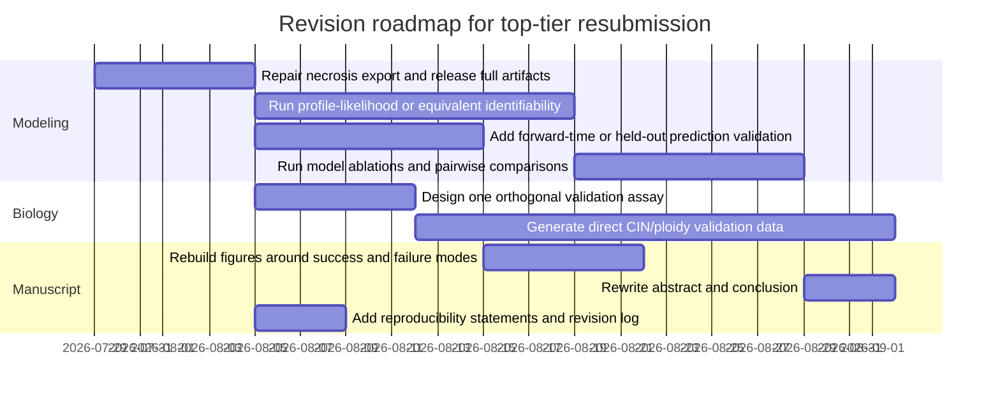

# Reviewer Report on the Revised Manuscript and Joint-Fitting Results

## Executive Summary

This is a scientifically important topic. Whole-genome doubling is common in advanced cancers, is associated with poor prognosis, and is now understood as a major driver of tumor evolution rather than a rare side phenomenon. In parallel, tumor hypoxia is increasingly recognized as a potent source of genomic instability and evolutionary selection pressure. A paper that truly links matched in vitro and in vivo ploidy dynamics through a well-identified mechanistic model could therefore be highly interesting. citeturn10search2turn10search3turn10search4turn10search0

My overall judgment is that the revised manuscript is **substantially improved in caution and interpretive honesty**, but it is **not yet ready for an IF≥30 journal**. The main reason is not that the central idea is weak; it is that the current manuscript still asks readers to accept a biologically ambitious interpretation from a model family that remains **practically non-identifiable in key directions, strongly basin-dependent in joint fitting, and insufficiently validated out of sample or orthogonally in biology**. The revision does a better job acknowledging these limits, but the paper still stops short of the validation standard that top-tier journals usually require for a mechanistic quantitative cancer-evolution study.

From my audit of the uploaded `top10.zip` archive, the strongest result is **directional**, not fully quantitative: among the retained joint basins, the model repeatedly prefers **lower fitted in vivo proliferation capacity**, **higher fitted stress-linked effective chromosome-missegregation under severe deprivation in vivo**, and **higher absolute post-missegregation daughter survival in vivo but a steeper ploidy-dependent survival gradient in vitro**. That is an interesting and potentially publishable mechanistic contrast. However, the uploaded archive also shows that **warm-start basin choice matters more than within-basin seed variability**, **many joint soft-coupled parameters sit on active bounds**, **all sixty retained joint top seeds reject local refinement**, and **the soft-coupling penalty is already close to saturation in the top retained solutions**. Those patterns weaken any claim of uniquely estimated effect size or uniquely resolved mechanism.

A second major issue is reproducibility. The repository documentation is strong enough to interpret the output files, and the fitting workflow is clearly described as DEoptim followed by optional serial L-BFGS-B refinement, with standardized per-seed outputs for separate and joint runs. But the uploaded evidence package is a **filtered top-10 archive**, not the full 500-seed landscape, and `joint_pre.zip` was not accessible in the current environment. That means I can verify the direction of the reported top solutions, but I cannot independently reproduce all manuscript claims that depend on the full 500-seed distributions or preprocessing provenance. Nature Portfolio journals, and similar top-tier venues, explicitly require transparent data and code availability for the minimum dataset, core algorithms, and reproducible workflows central to the paper’s claims. citeturn4view0turn4view1turn5view0turn7search0turn7search3turn9search0

The manuscript therefore has **clear promise** but still needs a decisive next round. If the goal is an IF≥30 placement, the revision should focus on five non-negotiables: **formal identifiability and uncertainty analysis, prediction-oriented model validation, stronger model comparison and ablation, orthogonal biological validation of the core inferred context contrast, and a full reproducibility release including repaired necrosis exports and the complete seed landscape**. Without those additions, the most defensible publication path would likely be a strong quantitative-biology or cancer-systems journal rather than a top-flight general venue.

## Review Standards Derived from prompt.md

The uploaded `prompt.md` asks for a review that is stricter than a normal stylistic read. Its core requirements can be summarized as follows.

| Prompt-derived requirement | What it means operationally in this review |
|---|---|
| Review manuscript, code, and results together | I evaluated the revised manuscript against the uploaded result archive and against the repository workflow documentation, rather than reviewing prose in isolation. |
| Identify core results that truly support claims | I separate **well-supported**, **directionally supported but under-identified**, and **currently over-claimed** conclusions. |
| Preserve manuscript logic unless genuinely necessary | My recommendations strengthen or narrow claims; they do not invent a new story. |
| No fabrication | I only report what is present in the manuscript, repository workflow documentation, or uploaded outputs. Where evidence is missing, I say so explicitly. |
| Reviewer-style report with evidence mapping | I map comments to novelty, significance, methods, statistical rigor, fitting, identifiability, convergence, robustness, reproducibility, figures, writing, and journal suitability. |
| Cite any new theoretical arguments | For modeling best practices, I anchor recommendations to established literature on practical identifiability, prediction-profile uncertainty, and predictive validation. citeturn6search2turn8search0turn8academia38turn11search3turn12search0 |
| Explicit reproducibility expectations | I treat missing preprocessing provenance, filtered seed archives, missing row-level necrosis predictions, and absent held-out validation as substantive review issues, not minor housekeeping. |

For a code-heavy mechanistic paper aimed at a very high-impact journal, the reproducibility standard is necessarily higher than “the code exists somewhere.” Nature Portfolio policies require transparent data availability, code availability, and access to the minimum dataset, algorithms, and protocols needed to verify and extend the work; the FAIR principles explicitly extend this logic to algorithms, tools, and workflows, not only raw datasets. citeturn7search0turn7search3turn9search0

That matters especially here because the manuscript’s strongest claims are not simple descriptive observations; they are **model-mediated inferences**. In that setting, best practice is not just to report one optimum, but to show whether parameters are practically identifiable, whether predictions are stable under uncertainty, and whether the model generalizes beyond the calibration target. Profile-likelihood methods are a standard way to assess practical identifiability and likelihood-based confidence intervals in dynamical systems, while prediction-profile approaches help quantify uncertainty in model predictions. For longitudinal predictive claims, ordinary in-sample fit or naive leave-one-out is not enough; prediction-oriented validation should respect temporal order, for example by forward-chaining or leave-future-out schemes. citeturn6search2turn8search0turn8academia38turn11search3turn12search0

## Repository Workflow and Uploaded Results Audit

The repository’s oxygen-model documentation is sufficiently explicit to interpret the uploaded results. It states that separate in vivo and in vitro fits are optimized with **DEoptim followed by optional serial L-BFGS-B refinement**, and that their main outputs include `fit_summary.tsv`, `best_params.tsv`, `best_params_transformed.tsv`, and `fit_result.rds`. For joint fitting, the README defines the total objective as the weighted sum of the in vivo objective, the in vitro objective, the soft-coupling penalty, and any constraint penalty; it also documents the meaning of `joint_soft_coupling.tsv`, `joint_components.tsv`, `joint_warmup_initial_values.tsv`, and related joint outputs. citeturn4view0turn4view1turn4view3turn4view4turn5view0

I was able to audit `prompt.md`, the revised manuscript text, and `top10.zip`. I was **not** able to audit `joint_pre.zip`, because it was not available in the current runtime despite being described as provided. That limitation matters: any preprocessing-dependent claim should be considered only partially verified until the archive is actually inspectable.

A second limitation is structural. The uploaded results are a **top-10 archive**, not the full 500-seed output. That means the uncertainty summaries below are **empirical spreads across the retained top solutions**, not formal confidence intervals and not full-search distributions. For a dynamical model paper, that distinction is important. True inferential uncertainty for parameters and predictions should come from explicit identifiability and uncertainty procedures, not from the spread of the best few optimization hits alone. citeturn6search2turn8academia38

The result-package semantics I used are summarized here.

| File family | Meaning used in this audit |
|---|---|
| `fit_summary.tsv` | Optimizer status, objective decomposition, sigma terms, convergence flags, counts of fitted observations |
| `best_params.tsv` | Natural-scale parameter estimates used to compute interpretable function contrasts |
| `best_params_transformed.tsv` | Optimizer-scale parameterization, useful for bound checks |
| `burden_fit.tsv`, `terminal_ploidy_fit.tsv`, `necrosis_fit.tsv` | In vivo data-stream fits and row-level predictions |
| `invitro_lineage_summary.tsv`, `invitro_daily_counts.tsv`, `invitro_distribution_*` | In vitro branch trajectories, chromosome distributions, and death-burden decomposition |
| `joint_soft_coupling.tsv` | Context-specific parameter values, context ratios, per-parameter penalties, feasibility, and transformed-space reconstructed values |
| `joint_components.tsv` | Joint objective partition into in vivo, in vitro, soft-coupling, and constraints |

### What the uploaded archive supports most strongly

The strongest author-facing evidence map is this one.

| Claim area | What the uploaded archive supports | What it does **not** yet support convincingly |
|---|---|---|
| Separate in vitro dynamics | Deprivation can generate a mixed chromosome-number distribution without requiring large direct hypoxia-origin death in the terminal severe-deprivation 4N lineage | Faithful recovery of the late split between the two terminal deprived 2N branches |
| Separate in vivo fit quality | Broad cohort-level burden scale and endpoint ploidy scale are captured | Uniformly high-fidelity tumor-specific trajectories or sharply identified mechanism |
| Joint context contrast | Across retained basins, directionally concordant context shifts exist in proliferation, effective missegregation under severe deprivation, and post-missegregation survival functions | A unique global optimum, unique effect size, or uniquely identified biological explanation |
| Reproducibility | File formats and output roles are interpretable from repository documentation | Full 500-seed landscape, preprocessing provenance, and row-level necrosis export integrity |

### Separate in vitro top-hit summary

Across the uploaded top ten in vitro seeds, the total objective is extremely tight, ranging from **3.8525 to 3.8623**. The final predicted mean chromosome number for the deprived 2N terminal branch is also tight, **63.72 to 64.40**, whereas the manuscript correctly notes the observed two-branch means of **66.85** and **88.05**. This is exactly the right interpretation: the model supports emergence of a mixed higher-ploidy state, but not the full late branch bifurcation. The predicted decline along the terminal severe-deprivation 4N lineage spans **2.92 to 3.44 chromosomes** in the uploaded top ten, and direct hypoxia-origin death in that lineage remains very small, with maximum burden fractions of **1.69% to 1.76%**.

| Seed | Objective | Growth loglik | Ploidy loglik | Flow loglik | Predicted final deprived 2N mean N | Predicted 4N severe-deprivation drop | Max direct hypoxia-death fraction in 4N severe deprivation |
|---|---:|---:|---:|---:|---:|---:|---:|
| seed10 | 3.8525 | 0.1706 | -3.0962 | -0.9269 | 64.2664 | 2.9464 | 0.0171 |
| seed132 | 3.8533 | 0.1723 | -3.0941 | -0.9314 | 64.2121 | 2.9167 | 0.0171 |
| seed81 | 3.8541 | 0.1714 | -3.0976 | -0.9279 | 64.3117 | 2.9621 | 0.0172 |
| seed294 | 3.8594 | 0.1720 | -3.1017 | -0.9296 | 64.2012 | 3.1152 | 0.0169 |
| seed337 | 3.8598 | 0.1851 | -3.1179 | -0.9270 | 64.1090 | 3.2373 | 0.0170 |
| seed106 | 3.8605 | 0.1667 | -3.1147 | -0.9126 | 63.7184 | 3.4322 | 0.0176 |
| seed317 | 3.8610 | 0.1643 | -3.1253 | -0.9000 | 64.0830 | 3.2344 | 0.0171 |
| seed140 | 3.8610 | 0.1637 | -3.1495 | -0.8753 | 64.4010 | 3.0253 | 0.0169 |
| seed285 | 3.8618 | 0.1583 | -3.1337 | -0.8863 | 63.9417 | 3.1755 | 0.0172 |
| seed464 | 3.8623 | 0.1834 | -3.1248 | -0.9209 | 63.7798 | 3.4385 | 0.0172 |

This is a real strength of the revision: the revised Results text now states the in vitro conclusion at the correct level of support rather than claiming recovery of every branch-specific endpoint.

At the same time, the in vitro archive also shows identifiability pressure. In the uploaded top ten, several fitted or effectively active in vitro parameters are pinned on bounds in every top solution: `buffer_smax` sits at its upper bound, while `alpha_o2`, `gamma_growth`, `gamma_mu`, and `mu_hp` sit at lower bounds in all ten retained top seeds. That does **not** by itself invalidate the in vitro inference, but it does mean some parameter-level biological interpretations remain underdetermined.

### Separate in vivo top-hit summary

The separate in vivo top ten objectives span **14.1193 to 14.1748**. Across these retained seeds, the positive-observation log-burden RMSE is **0.6629 to 0.6799**, equal-weighted tumor-level log-burden RMSE is **0.6284 to 0.6439**, terminal mean chromosome-number MAE is **2.41 to 3.71**, mean terminal Wasserstein-1 distance is **4.18 to 5.24 chromosomes**, mean total-variation distance is **0.681 to 0.714**, and reconstructed terminal necrosis-fraction MAE is **0.064 to 0.103**.

| Seed | Objective | Log-burden RMSE | Equal-weighted log-burden RMSE | Terminal mean-chromosome MAE | Mean W1 | Mean TV | Reconstructed necrosis MAE |
|---|---:|---:|---:|---:|---:|---:|---:|
| seed25 | 14.1193 | 0.6660 | 0.6317 | 2.4073 | 4.5080 | 0.6971 | 0.0911 |
| seed366 | 14.1340 | 0.6680 | 0.6341 | 2.5436 | 4.7513 | 0.7082 | 0.0782 |
| seed292 | 14.1372 | 0.6724 | 0.6384 | 2.7909 | 4.5905 | 0.6985 | 0.0644 |
| seed392 | 14.1406 | 0.6784 | 0.6426 | 3.3279 | 4.9227 | 0.6887 | 0.0935 |
| seed90 | 14.1524 | 0.6799 | 0.6439 | 3.6510 | 4.8626 | 0.6840 | 0.0922 |
| seed391 | 14.1553 | 0.6797 | 0.6439 | 3.3756 | 4.7537 | 0.6816 | 0.0910 |
| seed264 | 14.1558 | 0.6735 | 0.6400 | 2.5625 | 4.1840 | 0.6816 | 0.0791 |
| seed109 | 14.1724 | 0.6629 | 0.6284 | 2.8530 | 4.3029 | 0.6811 | 0.1025 |
| seed322 | 14.1724 | 0.6677 | 0.6331 | 2.5222 | 4.8560 | 0.7139 | 0.0781 |
| seed26 | 14.1748 | 0.6784 | 0.6425 | 3.7122 | 5.2392 | 0.6981 | 0.0939 |

This is broadly consistent with the revised manuscript’s own caveat: the model captures overall burden and endpoint scale better than it captures every tumor-specific terminal distribution. That is a defensible statement.

But the separate in vivo archive also gives direct evidence of practical non-identifiability. In the uploaded top ten, `sigma_burden` is at its upper bound in **all ten** retained seeds; `lam_max`, `p_misseg`, `buffer_n_exp`, and `o2_S0` hit upper bounds in **40%** of retained seeds; `alpha_o2` and `mu_hp` hit lower bounds in **30%**. Those are exactly the kinds of patterns for which parameter-profile analysis is expected before strong mechanistic interpretation. citeturn6search2turn8search0

A reproducibility issue is also visible here. In every checked separate in vivo seed, `necrosis_fit.tsv` contains missing row-level predicted values, so necrosis performance has to be reconstructed from the terminal burden tables rather than read directly from the advertised per-sample export. The revised manuscript now acknowledges this, which is good; the code and output should still be repaired before submission.

### Joint top-hit summary

The joint archive contains **six warm-start pair families**, each represented by the top ten retained numerical seeds. The best retained objectives differ substantially across pair families:

| Joint pair | Best seed | Best objective | Median objective | Median in vivo objective | Median in vitro objective | Median soft-coupling penalty | Median penalty / theoretical cap |
|---|---|---:|---:|---:|---:|---:|---:|
| fit_joint_tsne_vi_seed366_C01Sc01_vt_seed10 | seed472 | 18.8523 | 18.8606 | 14.1334 | 3.8560 | 0.8714 | 0.7781 |
| fit_joint_tsne_vi_seed322_C02Sc02_vt_seed10 | seed54 | 18.8901 | 18.9138 | 14.1725 | 3.8649 | 0.8760 | 0.7821 |
| fit_joint_tsne_vi_seed25_C02Sc01_vt_seed10 | seed497 | 18.9705 | 18.9728 | 14.1179 | 3.8525 | 1.0023 | 0.8949 |
| fit_joint_tsne_vi_seed311_C03Sc02_vt_seed10 | seed18 | 19.4145 | 19.4264 | 14.6048 | 3.8635 | 0.9579 | 0.8553 |
| fit_joint_tsne_vi_seed290_C01Sc02_vt_seed10 | seed155 | 19.7913 | 19.7990 | 14.9902 | 3.8592 | 0.9501 | 0.8483 |
| fit_joint_tsne_vi_seed138_C03Sc01_vt_seed10 | seed122 | 19.9782 | 20.0138 | 15.1915 | 3.8577 | 0.9626 | 0.8595 |

This table is one of the most important pieces of evidence in the archive. The **median within-pair top-ten objective range** is only about **0.017**, but the **best objective across pair families spans about 1.126**. In plain language: **within a warm-start family, the optimizer is numerically stable; across warm-start families, it lands in materially different basins**. That means warm-start basin selection dominates much more than within-basin seed noise. For a top-tier claim, this should be shown explicitly and discussed as a central limitation.

The joint archive also reveals several additional facts that matter for interpretation:

- In all **60/60** retained joint top seeds, **local refinement was attempted but rejected**, so final joint results are effectively DEoptim solutions without accepted local improvement.
- In all **60/60** retained joint top seeds, DEoptim stopped early with `early_stop_reltol_or_steptol`, after only **26 to 116** completed iterations versus a target of **500**.
- In all **60/60** retained joint top seeds, the joint predictive restriction switches are effectively off in the archived summaries: `joint_require_invivo_pred1000_ploidy_gt2 = FALSE`, `joint_require_invitro_growth_nonnegative = FALSE`, and `joint_require_invitro_ploidy_phenotype = FALSE`. So the retained solutions are not being selected under a strong predictive-phenotype constraint regime.
- Every retained joint solution has at least one active parameter bound; the median retained seed has **six** soft-coupled parameters at one or another active edge.

The most striking bound frequencies across the uploaded joint top sixty are:

| Joint soft-coupled parameter | Fraction of retained top seeds at an active bound |
|---|---:|
| `mu_hp` | 1.000 |
| `buffer_smax` | 1.000 |
| `alpha_o2` | 0.983 |
| `gamma_growth` | 0.983 |
| `gamma_mu` | 0.833 |
| `buffer_n_exp` | 0.500 |
| `p_misseg` | 0.333 |

This is direct evidence that the joint context-contrast story is being learned in a highly constrained part of parameter space. That does not mean the direction of the contrast is false. It does mean the manuscript should frame those contrasts as **conditional, basin-retained, bound-limited inferences**, not as precise biological effect-size estimates.

### Joint function-level contrasts

The function-level contrasts are nevertheless genuinely interesting. Using the natural-scale context-specific values in `joint_soft_coupling.tsv`, I evaluated the chromosome-missegregation and post-missegregation-survival functions in the same spirit as the manuscript. Using pair medians as the unit of summary, the retained top basins show the following pattern:

| Contrast | Median of pair medians | Minimum pair median | Maximum pair median |
|---|---:|---:|---:|
| In vivo / in vitro `lam_max` | 0.1771 | 0.0992 | 0.2225 |
| In vivo / in vitro `p_misseg` | 16.8394 | 11.1202 | 47.3776 |
| In vivo / in vitro `O2_crit` | 0.1681 | 0.0661 | 0.6083 |
| In vivo / in vitro `buffer_beta` | 0.0708 | 0.0109 | 0.1429 |
| Effective missegregation ratio at 0% O2, N=44 | 18.9387 | 11.1396 | 48.0818 |
| Effective missegregation ratio at 1% O2, N=44 | 12.9283 | 7.4257 | 29.1201 |
| Effective missegregation ratio at 5% O2, N=44 | 1.0476 | 0.3890 | 5.4483 |
| Post-missegregation survival ratio at N=44 | 3.9604 | 3.5740 | 4.6720 |
| Post-missegregation survival ratio at N=88 | 1.0888 | 1.0774 | 1.1450 |
| In vivo survival increase from N=44 to N=88 | 0.0959 | 0.0063 | 0.1856 |
| In vitro survival increase from N=44 to N=88 | 0.6330 | 0.6330 | 0.6330 |
| Soft-coupling penalty as fraction of theoretical cap | 0.8518 | 0.7781 | 0.8949 |

Two conclusions are solidly directionally supported in the uploaded top archive.

First, the retained joint basins almost always prefer **much higher effective missegregation in vivo at very low oxygen/resource states** than in vitro, while that contrast shrinks markedly by 5% O2. That is an interpretable and biologically interesting result.

Second, the retained basins prefer **higher absolute post-missegregation daughter survival in vivo** at both 44 and 88 chromosomes, but a **much steeper ploidy-dependent survival gain in vitro**. That is a real function-level contrast and, as the manuscript says, cannot be seen by inspecting one parameter in isolation.

At the same time, the penalty fractions show that these retained contrasts are not “cheap” adjustments around a common center. The median retained pair already pays **about 85% of the theoretical penalty cap**, consistent with many per-parameter penalty terms sitting in the saturating regime. Because the Welsch penalty saturates, large context splits are no longer strongly shrunk once they are already large. The repo explicitly documents this near-quadratic-near-zero and saturated-for-large-offset behavior. citeturn4view4turn5view0

## Reviewer-Style Critique of the Revised Manuscript

The revised manuscript is noticeably better than a typical over-claimed modeling submission. It now repeatedly tells the reader where oxygen is a latent formal variable rather than a direct physical measurement, it downgrades the in vitro deprived-2N claim to the correct “mixed distribution rather than faithful branch bifurcation” level, and it openly acknowledges practical non-identifiability, basin dependence, small spectral gaps, and the necrosis export limitation. Those are meaningful improvements and should be preserved.

The remaining problem is not candor. It is that the manuscript is still **trying to carry a top-tier biological conclusion with a model that has not yet passed the validation gauntlet needed for that level of claim**.

### Criterion-by-criterion assessment

| Criterion | Current assessment | Why it is not yet IF≥30-ready |
|---|---|---|
| Novelty | **Moderately strong** | The matched in vitro/in vivo ploidy framework and soft-coupled joint fitting are interesting and not routine. |
| Significance | **Potentially high** | WGD, aneuploidy, and hypoxia/resource stress are important cancer-evolution topics. But significance is currently potential rather than demonstrated mechanistic closure. citeturn10search2turn10search3turn10search4 |
| Hypothesis clarity | **Improved but still not fully sharp** | The paper now says oxygen is a latent proxy for broader resource stress, but the title, framing, and some result phrasing still let readers overread it as oxygen-specific biology. |
| Methods | **Technically serious** | The model is thoughtfully built and the repository workflow is better documented than average. citeturn4view0turn4view1turn5view0 |
| Statistical rigor | **Insufficient for the ambition of the claims** | In-sample fit and top-hit summaries are not enough; there is no true uncertainty quantification for parameters or forward prediction. citeturn6search2turn8academia38turn11search3turn12search0 |
| Model fitting and convergence | **Mixed** | Separate fits behave reasonably; joint fits are basin-stable within warm starts but not across warm starts, and local refinement never improves retained joint solutions. |
| Parameter identifiability | **Currently inadequate** | Bound saturation and basin dependence are too strong to support precise biological effect-size language. Profile likelihood or equivalent analyses are missing. citeturn6search2turn8search0 |
| Robustness | **Partial** | Directional contrasts are robust across six retained joint basins, but full-search robustness and preprocessing robustness are not yet demonstrated. |
| Reproducibility | **Not submission-ready for a top-tier journal** | The archive is filtered, preprocessing was not inspectable, and row-level necrosis export is broken. Nature-level venues will expect a cleaner package. citeturn7search0turn7search3turn9search0 |
| Figures and tables | **Conceptually good, diagnostically incomplete** | Current figure logic tells the story, but does not yet expose enough model-risk information. |
| Writing | **Strongly improved** | Discussion is thoughtful and caveated. The next step is sharper claim hierarchy, not a full rewrite. |
| IF≥30 suitability | **Not yet** | Needs one more major revision centered on validation, identifiability, and biological confirmation. |

### Major scientific concerns

**The central biological interpretation is still more precise than the current evidence warrants.** The manuscript’s best-supported conclusion is that a common latent resource-stress framework can generate context-dependent contrasts in proliferation, effective missegregation, and post-missegregation survival between matched culture and tumor settings. That is interesting and publishable. What is not yet fully earned is the stronger implication that the study has isolated a uniquely resolved mechanistic explanation of why ploidy evolves differently across contexts. The uploaded archive shows too much boundary pressure and warm-start dependence for that stronger version.

**The joint-fitting narrative is directionally robust but not quantitatively unique.** Within each warm-start pair, objective spread is small. Across the six pair families, it is large. That is the signature of a multi-basin problem in which “directional concordance across retained basins” is a fair output, but “the fitted mechanism is X” is still too strong. The revised manuscript already says this in parts of the Discussion. The Abstract, final figure messaging, and concluding take-home need to be aligned to that same standard.

**Prediction-oriented validation is still missing.** For longitudinal or trajectory-generating models, top journals will expect some version of held-out prediction, not only calibration fit. In this case that could mean leaving out later passages in vitro, leaving out one or more tumors in vivo, or performing explicit forward-time validation on branch suffixes. In longitudinal settings, ordinary leave-one-out can be optimistic because future observations leak information backward; leave-future-out or other forward-chaining logic is the appropriate standard. citeturn11search3turn12search0

**Identifiability is acknowledged but not solved.** The paper basically diagnoses its own biggest hurdle, then stops one step before the remedy. That remedy is not another paragraph of caveat; it is a quantitative identifiability analysis. At minimum, the high-IF version of this paper needs parameter-profile or prediction-profile results for the core cross-context contrasts. Without that, the result remains a suggestive mechanism rather than a rigorously estimated one. citeturn6search2turn8search0turn8academia38

**The biological validation gap is still too large.** The current study infers that severe resource limitation in vivo drives markedly higher effective missegregation while also allowing greater absolute survival of altered daughters, with a steeper ploidy-dependent survival gradient in vitro. Those are mechanistically rich claims. But they remain model-mediated until tested by an orthogonal readout: direct chromosome-segregation imaging, lineage tracing, single-cell DNA karyotyping across time, or controlled oxygen-versus-nutrient disentangling. A top-tier journal will almost certainly want at least one such confirmation.

### Major presentation concerns

**The title and abstract should shift from “oxygen” toward “latent resource stress” unless direct oxygen measurements are added.** The manuscript now says this correctly in the body and Discussion. The front matter should match.

**The current figures tell the scientific story better than they tell the statistical-risk story.** The paper needs one explicit diagnostics figure that shows basin dependence, active bounds, soft-coupling saturation, and where the model succeeds versus misses the data. Right now those facts are scattered in prose and supplement-like descriptions.

**The paper should distinguish clearly between three claim levels:** observed data facts, model-supported directional contrasts, and therapeutic/speculative hypotheses. The revised Discussion is already close to this structure. The Abstract should follow it.

## High-Impact Revision Priorities and Suggested Text Edits

The most efficient way to make this paper competitive for a very high-impact venue is to focus on the gap between **interesting mechanistic story** and **validated quantitative inference**.

### Additional analyses and experiments ranked by impact and feasibility

| Priority | Recommendation | Expected impact | Feasibility | Why it matters |
|---|---|---:|---:|---|
| Highest | **Formal identifiability analysis for the core joint contrasts** using profile likelihood or equivalent | Very high | Medium | Converts caveated intuition into quantitative inference; directly addresses bound hits and basin multiplicity. citeturn6search2turn8search0turn8academia38 |
| Highest | **Prediction-oriented validation** with held-out passages, held-out tumors, or forward-time suffix prediction | Very high | Medium | Demonstrates that the model predicts, not just interpolates. citeturn11search3turn12search0 |
| Highest | **Model comparison and ablation**: oxygen-only versus latent composite resource axis; with/without oxygen-independent aneuploidy cost; with/without context-specific WGD; with/without soft coupling | Very high | Medium | Shows whether the headline mechanism is actually necessary rather than merely sufficient. |
| Highest | **Repair and release all reproducibility artifacts**: full 500-seed summaries, `joint_pre.zip`, preprocessing scripts, necrosis export fix, one-click reproduction instructions | Very high | High | This is mandatory for reviewer confidence and for top-tier submission readiness. citeturn7search0turn7search3turn9search0 |
| High | **Orthogonal biological validation of the joint contrasts**: direct missegregation assay, time-resolved single-cell karyotyping, or lineage-tracing under controlled deprivation | Very high | Low to medium | This is likely the difference between a specialist modeling paper and an IF≥30 contender. |
| High | **Global sensitivity and prediction uncertainty analysis** on the fitted outputs, not just one-at-a-time scans | High | Medium | Clarifies which biological conclusions are stable to uncertainty versus fragile. |
| Medium | **Broaden the joint warm-start design** beyond a single in vitro anchor | Medium | Medium | Right now the context comparison is under-sampled on the in vitro side. |
| Medium | **Mouse-level or tumor-level random effects / hierarchical variation** for in vivo dynamics | Medium | Low to medium | Would improve realism and reduce overinterpretation of cohort-shared parameters. |

### Suggested abstract revision

A stronger abstract should be **more mechanistically focused and more defensible**, not more aggressive. A possible revision is:

> **Proposed abstract language**  
> Whole-genome doubling and chromosome instability reshape cancer ploidy distributions, but whether matched culture and tumor trajectories can be interpreted on a common resource-stress axis remains unclear. We developed a mechanistic chromosome-state model jointly calibrated to matched near-diploid and near-tetraploid SUM159 lineages in culture and orthotopic tumors. Separate in vitro fits reproduced generation of mixed chromosome-number states under deprivation, although they did not recover the late divergence of the two terminal deprived 2N branches. Separate in vivo fits captured cohort-level burden and endpoint ploidy scales but retained multiple practically similar parameter regimes. Across six retained joint soft-coupled basins, the model consistently favored lower effective proliferation capacity, lower fitted oxygen-response threshold, and higher low-resource effective chromosome-missegregation in vivo, together with higher absolute post-missegregation daughter survival in vivo but a steeper ploidy-dependent survival gradient in vitro. These contrasts are conditional on the fitted model and are limited by active parameter bounds and incomplete identifiability, but they support the hypothesis that matched culture and tumor data can be compared on a common latent resource-stress axis.

This version does three things better: it states the novelty, states the strongest supported result, and keeps the caveat visible without burying the paper.

### Suggested key-figure revisions

**For the matched-data overview figure**, add an explicit labeling layer that separates:
- **directly observed quantities**,
- **latent inferred trajectories**, and
- **function-level inferred mechanisms**.

That will reduce the risk that readers interpret inferred oxygen states or inferred internal transition burdens as directly measured biology.

**For the in vitro reshaping figure**, add a small explicit “model miss” panel showing the terminal deprived 2N branch divergence failure. Counterintuitively, that will make the rest of the figure more convincing, because it shows the reader exactly where the model succeeds and where it does not.

**For the in vivo landscape figure**, add a diagnostics inset that shows:
- the top-ten bound-hit frequencies,
- the range of terminal ploidy distance metrics,
- and one held-out or forward prediction example if you can add it.

**For the joint-context figure**, add a panel that shows the following side by side:
- best objective by warm-start family,
- within-family top-ten objective spread,
- soft-coupling penalty fraction of cap,
- and active-bound frequency by parameter.

That one panel would visually explain the most important technical limitation in the current study.

### Suggested conclusion revision

The conclusion should end on a tighter, more durable claim. I would recommend something like:

> **Proposed conclusion language**  
> Our results support the view that matched culture and tumor ploidy trajectories can be interpreted within a common latent resource-stress framework, but they do not yet identify a unique mechanistic parameter set. Across retained joint basins, the model consistently favors lower effective proliferation capacity and stronger low-resource chromosome-missegregation in vivo, together with higher absolute post-missegregation daughter survival in vivo and a steeper ploidy-dependent survival gradient in vitro. These directional contrasts motivate direct experimental tests of context-dependent chromosome missegregation and daughter-cell survival, and they define the specific validation steps required to distinguish a robust biological mechanism from a model-contingent explanation.

That ending sounds confident without overpromising.

## Action Plan and Prioritized Checklist

The most practical revision sequence is shown below.

The revision checklist I would prioritize is this:

- **Must do before any serious top-tier submission**
  - Release the full reproducibility package: full 500-seed summaries, accessible preprocessing, repaired necrosis outputs, exact environment and execution instructions.
  - Add formal identifiability and uncertainty analysis for the headline joint contrasts.
  - Add prediction-oriented validation that respects time order.

- **Highest-value scientific upgrade**
  - Add at least one orthogonal biological validation that directly tests either context-dependent missegregation or post-missegregation survival.

- **Highest-value modeling upgrade**
  - Compare the headline model against at least two biologically plausible alternatives or ablations, and show why the preferred mechanism is necessary.

- **Highest-value writing upgrade**
  - Recast the paper around a latent resource-stress interpretation, not oxygen-specific causality, unless direct oxygen/resource measurements are newly added.

- **Highest-value figure upgrade**
  - Add one diagnostics figure that makes basin dependence, soft-coupling saturation, and active bounds visible at a glance.

- **Final framing decision**
  - If the additional validation cannot be completed, narrow the manuscript’s claims and target a strong specialist venue rather than an IF≥30 journal.

My bottom-line recommendation is therefore: **major revision, with high enthusiasm for the direction of the work but clear concern that the current evidence package is not yet strong enough for a top-tier general journal**. The manuscript is close to being a strong quantitative cancer-evolution paper. To become a top-flight paper, it needs to convert a compelling model story into a demonstrably identified, predictive, and biologically corroborated mechanism.